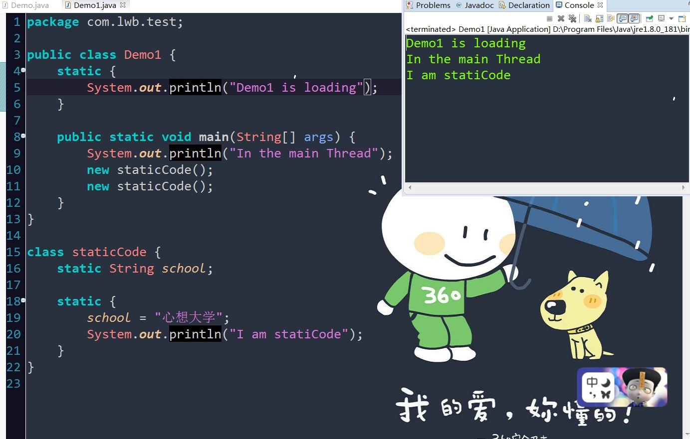

##聊一聊static关键字吧

> static啥意思啊?

  static表示"全局"或者"静态"的意思,用来修饰成员变量和成员方法,也可以形成静态的代码块

  被static修饰的成员变量和成员方法独立于该类的任何对象。意味着，它不依赖类的特定实例，被类的所有实例共享。

 1.static变量:

  按照是否静态对类成员变量进行分类可分为两种:一种就是被static修饰的变量,叫做静态变量或者类变量; 另一种就是没有被static修饰的变量,叫实例变量。

 >> 两者有啥区别呢？

  对于静态变量在内存中只有一次拷贝（节省内存），jvm只为静态分配一次内存,在加载类的过程中完成静态变量的内存分配,可用类名直接访问(方便),当然可以通过对象来访问(但是不建议)

  对于实例变量,每创建一个实例,就会为实例变量分配一次内存,实例变量可以在内存中有多个拷贝,互不影响(灵活)

  所以,一般在需要实现以下功能时使用静态变量:

  在对象之间共享值时;
  
  方便访问变量时.

2.静态方法:
	
  静态方法可以直接通过类名调用,任何实例也都可以调用.

  静态方法中不能用this和super关键字,不能直接访问所属类的实例变量和实例方法(就是不带static修饰的成员变量和成员方法),只能访问所属类的静态成员变量和成员方法。

>>有疑问吗？为啥静态方法中不能用this和super关键字呢???

  首先,理解一下下,this和super是什么呢?

  this表示当前对象的引用,super表示父类对象的引用。

  通过上面的学习，我们知道静态成员优先于对象加载到内存中，它是随着类的加载而加载的。

  如果静态方法中有this和super关键字,那么当静态方法被加载到内存中,其中this和super也被加载到内存中,但是对象还没创建,this和super还没被初始化,所以加载时会报错。

3.static代码块：

  static代码块也叫静态代码块，是在类中独立于类成员的static语句块，可以有多个，位置可以随便放，它不在任何方法体内，jvm加载时会执行这些静态代码块,如果static代码块有多个,jvm将按照它们在类中出现的先后顺序依次执行它们,每个代码块只会被执行一次。

  例如：

  

 >> 观察打印输出的信息,总结一下呗:

  a.定义的类staticcode中的静态代码块被自动执行,尽管产生了类的staticcode的两个实例对象,但其中的静态代码块只被执行一次并且只有在类被使用时才会执行类中的静态代码块.

  b.类中第一个被使用的时候才被装载,而不是在程序启动时就装载程序中所有可能要用到的类
  

4.常见问法:

>>  是不是经常在书上或者其他视频讲解中发现这个呢:

  static方法无法访问非static的实例,也就是没有static修饰 的变量?

  现在你肯定知道了吧

5.前面时不时总提到jvm,啥是jvm啊,可能,你也知道了,就是java的内存模型,下一节,我们来初识jvm(从重新输出打印helloworld开始说起),唠唠嗑,增加一下阅读兴趣嘛

6.来看看别人家写的,学会借鉴嘛:

##   [https://www.cnblogs.com/xiaoxi/p/6401481.html](https://www.cnblogs.com/xiaoxi/p/6401481.html)

