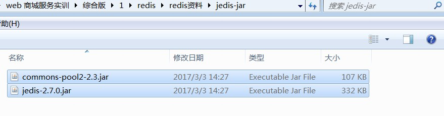
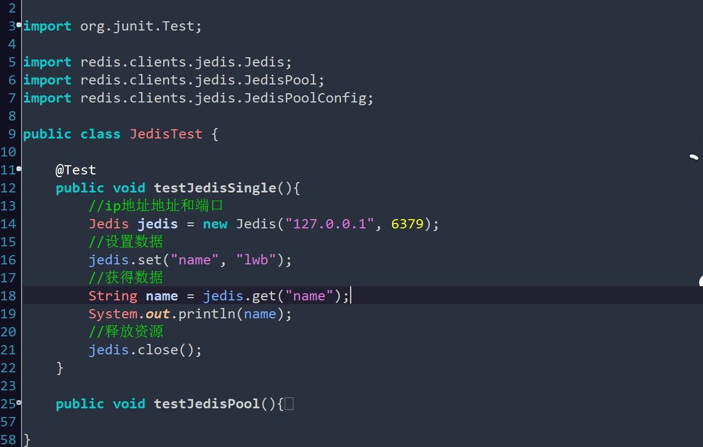

##初识Redis,Jedis

首先,明确一下,什么是redis,它有啥特征,它能做什么?

*	什么是Redis

	Redis是完全开源免费的,遵守BSD协议,是一个高性能的key-value数据库。

*	Redis的特点：

	Redis与其他key-value缓存产品有以下三个特点:

	a.Redis支持数据的持久化,可以将内存中的数据保存在磁盘中,重启的时候可以再次加载进行使用

	b.Redis不仅仅支持简单的key-value类型的数据,同时还提供list,set,zset,hash等数据结构的存储。

	c.Redis支持数据的备份,即master-salve模式的数据备份。
	
*	Redis能做什么,优势之处:

	性能极高 – Redis能读的速度是110000次/s,写的速度是81000次/s 。

	丰富的数据类型 – Redis支持二进制案例的 Strings, Lists, Hashes, Sets 及 Ordered Sets 数据类型操作。

	原子 – Redis的所有操作都是原子性的，意思就是要么成功执行要么失败完全不执行。单个操作是原子性的。多个操作也支持事务，即原子性，通过MULTI和EXEC指令包起来。

	丰富的特性 – Redis还支持 publish/subscribe, 通知, key 过期等等特性


###参考教程,菜鸟教程:

##[http://www.runoob.com/redis/redis-intro.html](http://www.runoob.com/redis/redis-intro.html)

*	安装redis


  windows下安装redis,直接运行exe即可:


## Centos下安装Redis

####	1、安装redis

*	第一步：下载redis安装包

wget http://download.redis.io/releases/redis-4.0.6.tar.gz

	[root@iZwz991stxdwj560bfmadtZ local]# wget http://download.redis.io/releases/redis-4.0.6.tar.gz

     --2017-12-13 12:35:12--  http://download.redis.io/releases/redis-4.0.6.tar.gz
	Resolving download.redis.io (download.redis.io)... 109.74.203.151
	Connecting to download.redis.io (download.redis.io)|109.74.203.151|:80... connected.
	HTTP request sent, awaiting response... 200 OK
	Length: 1723533 (1.6M) [application/x-gzip]
	Saving to: ‘redis-4.0.6.tar.gz’
 
	100%[==========================================================================================================>] 1,723,533    608KB/s   in 2.8s  
	 
	2017-12-13 12:35:15 (608 KB/s) - ‘redis-4.0.6.tar.gz’ saved [1723533/1723533]
 

*	第二步：解压压缩包

   tar -zxvf redis-4.0.6.tar.gz


	root@iZwz991stxdwj560bfmadtZ local]# tar -zxvf redis-4.0.6.tar.gz
　

*	第三步：yum安装gcc依赖

   yum install gcc


	[root@iZwz991stxdwj560bfmadtZ local]# yum install gcc　　

	遇到选择,输入y即可<br><br><br>

*	第四步：跳转到redis解压目录下

   cd redis-4.0.6


	[root@iZwz991stxdwj560bfmadtZ local]# cd redis-4.0.6
 

*	第五步：编译安装

make MALLOC=libc　　


	[root@iZwz991stxdwj560bfmadtZ redis-4.0.6]# make MALLOC=libc
　　

 将/usr/local/redis-4.0.6/src目录下的文件加到/usr/local/bin目录

 cd src && make install


	[root@iZwz991stxdwj560bfmadtZ redis-4.0.6]# cd src && make install
    CC Makefile.dep
 
	Hint: It's a good idea to run 'make test' ;)
 
    INSTALL install
    INSTALL install
    INSTALL install
    INSTALL install
    INSTALL install
　　

*	第六步：测试是否安装成功 

先切换到redis src目录下

1
	[root@iZwz991stxdwj560bfmadtZ redis-4.0.6]# cd src
 

1、直接启动redis

./redis-server

	[root@iZwz991stxdwj560bfmadtZ src]# ./redis-server
	18685:C 13 Dec 12:56:12.507 # oO0OoO0OoO0Oo Redis is starting oO0OoO0OoO0Oo
	18685:C 13 Dec 12:56:12.507 # Redis version=4.0.6, bits=64, commit=00000000, modified=0, pid=18685, just started
	18685:C 13 Dec 12:56:12.507 # Warning: no config file specified, using the default config. In order to specify a config file use ./redis-server /path/to/redis.conf
	                _._                                                 
	           _.-``__ ''-._                                            
	      _.-``    `.  `_.  ''-._           Redis 4.0.6 (00000000/0) 64 bit
	  .-`` .-```.  ```\/    _.,_ ''-._                                  
	 (    '      ,       .-`  | `,    )     Running in standalone mode
	 |`-._`-...-` __...-.``-._|'` _.-'|     Port: 6379
	 |    `-._   `._    /     _.-'    |     PID: 18685
	  `-._    `-._  `-./  _.-'    _.-'                                  
	 |`-._`-._    `-.__.-'    _.-'_.-'|                                 
	 |    `-._`-._        _.-'_.-'    |           http://redis.io       
	  `-._    `-._`-.__.-'_.-'    _.-'                                  
	 |`-._`-._    `-.__.-'    _.-'_.-'|                                 
	 |    `-._`-._        _.-'_.-'    |                                 
	  `-._    `-._`-.__.-'_.-'    _.-'                                  
	      `-._    `-.__.-'    _.-'                                      
	          `-._        _.-'                                          
	              `-.__.-'                                              
	 
	18685:M 13 Dec 12:56:12.508 # WARNING: The TCP backlog setting of 511 cannot be enforced because /proc/sys/net/core/somaxconn is set to the lower value of 128.
	18685:M 13 Dec 12:56:12.508 # Server initialized
	18685:M 13 Dec 12:56:12.508 # WARNING overcommit_memory is set to 0! Background save may fail under low memory condition. To fix this issue add 'vm.overcommit_memory = 1' to /etc/sysctl.conf and then reboot or run the command 'sysctl vm.overcommit_memory=1' for this to take effect.
	18685:M 13 Dec 12:56:12.508 # WARNING you have Transparent Huge Pages (THP) support enabled in your kernel. This will create latency and memory usage issues with Redis. To fix this issue run the command 'echo never > /sys/kernel/mm/transparent_hugepage/enabled' as root, and add it to your /etc/rc.local in order to retain the setting after a reboot. Redis must be restarted after THP is disabled.
	18685:M 13 Dec 12:56:12.508 * Ready to accept connections　　
 

如上图：redis启动成功，但是这种启动方式需要一直打开窗口，不能进行其他操作，不太方便。

 

按 ctrl + c可以关闭窗口。

　　

2、以后台进程方式启动redis

第一步：修改redis.conf文件

将daemonize no　修改为daemonize yes
　　

第二步：指定redis.conf文件启动

./redis-server /usr/local/redis-4.0.6/redis.conf

[root@iZwz991stxdwj560bfmadtZ src]# ./redis-server /usr/local/redis-4.0.6/redis.conf

	18713:C 13 Dec 13:07:41.109 # oO0OoO0OoO0Oo Redis is starting oO0OoO0OoO0Oo
	18713:C 13 Dec 13:07:41.109 # Redis version=4.0.6, bits=64, commit=00000000, modified=0, pid=18713, just started
	18713:C 13 Dec 13:07:41.109 # Configuration loaded
	 

第三步：关闭redis进程

首先使用ps -aux | grep redis查看redis进程

[root@iZwz991stxdwj560bfmadtZ src]# ps -aux | grep redis

	root     18714  0.0  0.1 141752  2008 ?        Ssl  13:07   0:00 ./redis-server 127.0.0.1:6379
	root     18719  0.0  0.0 112644   968 pts/0    R+   13:09   0:00 grep --color=auto redis
	 

使用kill命令杀死进程

[root@iZwz991stxdwj560bfmadtZ src]# kill -9 18714
　　


*	第七步：设置redis开机自启动

1、在/etc目录下新建redis目录

mkdir redis


[root@iZwz991stxdwj560bfmadtZ etc]# mkdir redis
 

2、将/usr/local/redis-4.0.6/redis.conf 文件复制一份到/etc/redis目录下，并命名为6379.conf　　


[root@iZwz991stxdwj560bfmadtZ redis]# cp /usr/local/redis-4.0.6/redis.conf /etc/redis/6379.conf
　　

3、将redis的启动脚本复制一份放到/etc/init.d目录下


[root@iZwz991stxdwj560bfmadtZ init.d]# cp /usr/local/redis-4.0.6/utils/redis_init_script /etc/init.d/redisd
　　

4、设置redis开机自启动

先切换到/etc/init.d目录下

然后执行自启命令


[root@iZwz991stxdwj560bfmadtZ init.d]# chkconfig redisd on

service redisd does not support chkconfig　看结果是redisd不支持chkconfig

解决方法：

使用vim编辑redisd文件，在第一行加入如下两行注释，保存退出


 chkconfig:   2345 90 10

 description:  Redis is a persistent key-value database

注释的意思是，redis服务必须在运行级2，3，4，5下被启动或关闭，启动的优先级是90，关闭的优先级是10。


 

再次执行开机自启命令，成功


[root@iZwz991stxdwj560bfmadtZ init.d]# chkconfig redisd on
　　

现在可以直接已服务的形式启动和关闭redis了

启动：

service redisd start　　


[root@izwz991stxdwj560bfmadtz ~]# service redisd start

	Starting Redis server...
	2288:C 13 Dec 13:51:38.087 # oO0OoO0OoO0Oo Redis is starting oO0OoO0OoO0Oo
	2288:C 13 Dec 13:51:38.087 # Redis version=4.0.6, bits=64, commit=00000000, modified=0, pid=2288, just started
	2288:C 13 Dec 13:51:38.087 # Configuration loaded
 

关闭：

service redisd stop


[root@izwz991stxdwj560bfmadtz ~]# service redisd stop

	Stopping ...
	Redis stopped
	　　


参考资料：

1、http://blog.csdn.net/zc474235918/article/details/50974483

2、http://blog.csdn.net/gxw19874/article/details/51992125

 

如果出现如下问题：

[root@iZwz991stxdwj560bfmadtZ ~]# service redisd start

	/var/run/redis_6379.pid exists, process is already running or crashed　　

以上转载:

##[https://www.cnblogs.com/zuidongfeng/p/8032505.html](https://www.cnblogs.com/zuidongfeng/p/8032505.html)


##Jedis

首相,明确一下,Jedis是redis的java版本的客户端实现。

这里简单测试一下使用案例:

*	第一步,导入jar,提供以下两个jar包




Jedis方式:

通过redis.clients.jedis.JedisPool来管理，即通过池来管理，通过池对象获取jedis实例，然后通过jedis实例直接操作redis服务，剔除了与业务无关的冗余代码，如下面的代码片段：

	private JedisPool jedisPool;
 
	public String save(String key,String val) {
   	    Jedis jedis = jedisPool.getResource();
    	return jedis.set(key, val);
	}

从工厂类到池的方式变化，就相当于mybatis连接mysql方变化是一样的，代码变得更简洁，维护也更容易了。

Jedis使用apache commons-pool2对Jedis资源池进行管理，所以在定义JedisPool时一个很重要的参数就是资源

池GenericObjectPoolConfig，使用方式如下，其中有很多资源管理和使用的参数。


>> JedisPool保证资源在一个可控范围内，并且提供了线程安全，但是一个合理的.在当前环境下，Jedis连接就是资源，JedisPool管理的就是Jedis连接。


*	第二步,编写测试代码:

单例连接:



连接池连接:


* 第三步,实例中应用的:


响应代码:

	<script>
		//向服务端发起ajax请求,服务端经过处理
		/* var url = "/store_v1/CategoryServlet";
		var obj = {"method":"findAllCats"}; */
		 $(function(){
				$.post("${pageContext.request.contextPath}/CategoryServlet",{"method":"findAllCats"},function(dt){
				 	alert(dt);  //测试
				    $.each(dt,function(i,obj){
						var li="<li><a href='${pageContext.request.contextPath}/ProductServlet?method=findProductsByCidWithPage&num=1&cid="+obj.cid+"'>"+obj.cname+"</a></li>"; //href的单引号双引号问题
						$("#myUL").append(li);
					}); 
				 
				},"json");
			});	 
	</script>

2端测试:


*	明白? :$.each遍历json对象

查看一个简单的jQuery的例子来遍历一个JavaScript数组对象。

	var json = [

	    {"id":"1","tagName":"apple"},
	
	    {"id":"2","tagName":"orange"},
	
	    {"id":"3","tagName":"banana"},
	
	    {"id":"4","tagName":"watermelon"},
	
	    {"id":"5","tagName":"pineapple"}
	
		];
	 
	$.each(json, function(idx, obj) {
	    alert(obj.tagName);
	});

测试看看呗:


*	明白? : $.post

定义和用法

post() 方法通过 HTTP POST 请求从服务器载入数据。

语法

jQuery.post(url,data,success(data, textStatus, jqXHR),dataType)

参数	描述
	url	必需。规定把请求发送到哪个 URL。

	data 可选。映射或字符串值。规定连同请求发送到服务器的数据。

	success(data, textStatus, jqXHR) 可选。请求成功时执行的回调函数。

	dataType 可选。规定预期的服务器响应的数据类型。默认执行智能判断（xml、json、script 或 html）。


详情参考:
##[http://www.runoob.com/jquery/ajax-post.html](http://www.runoob.com/jquery/ajax-post.html)


*	明白?: $.post()请求 他与get之间的区别 
  
        1、GET会将参数跟在URL后进行传递，而POST请求则是作为HTTP消息的实体内容 
        发送给WEB服务器。当然，在Ajax请求中，这种区别对用户是可见的。 
         
        2、GET方式对传输的数据大小限制（通常不能大于2KB），而使用POST方式传递 
        数据量要比GET方式大的多（理论上不受限制） 
 
        3、GET方式请求的数据会被浏览器缓存起来，因此其他人可以从浏览器的历史记录 
        中读取到这些数据，例如账号、密码等，在某种情况下，GET方式会带来严重的安全 
        性问题，而POST方式相对来说可以避免这些问题 
 
        4、GET方式和POST方式传递的数据在服务器上获取也是不相同。在PHP中，GET方式 
        的数据可以用$_GET[]获取，而POST方式可以用$_POST[]获取，两种方式都可以用 
        $_REQUEST[]来获取。 


*	明白? :详解jQuery中ajax函数：$.get(),$.post(),$.ajax()

参考链接:
##[https://blog.csdn.net/tb3039450/article/details/52145583](https://blog.csdn.net/tb3039450/article/details/52145583)