##Maven技术:

一.Maven简介:

基于Ant的构建工具,Ant有的功能Maven都有,额外添加了其他功能.(Ant和Maven都是构建工具)

1.运行原理:

1.1.本地仓库: 计算机中一个文件夹,自己定义是哪个文件夹;

1.2.中央仓库:网上地址https://repo1.maven.org/maven2/  (国外地址)
           1.2.1.下载速度慢--> 配置国内镜像(阿里云的)

1.3. 保证JDK版本和开发环境一致

图示:

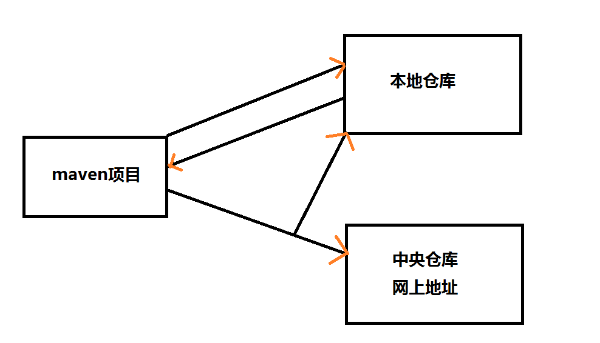

2.坐标概念:
   2.1.1. 每一jar文件都有一个唯一坐标.通过坐标可以精确确定是哪个jar包
   
   2.1.2.坐标组成:
   
       2.1.1 Group ID : 公司名.公司网址倒写
            2.1.2 Artifact ID : 项目名
            2.1.3 Version : 版本
3.pom:
3.1 英文名称(Project Object Mode)
3.2 项目对象模型
3.2.1 把project当作对象看待.
3.2.2 通过maven构建工具可以让对象(项目)和对象(项目)之间产生关系

4.查看坐标的网址: http://mvnrepository.com/

二.新建maven项目:

1.maven安装包下载:       http://maven.apache.org/download.cgi

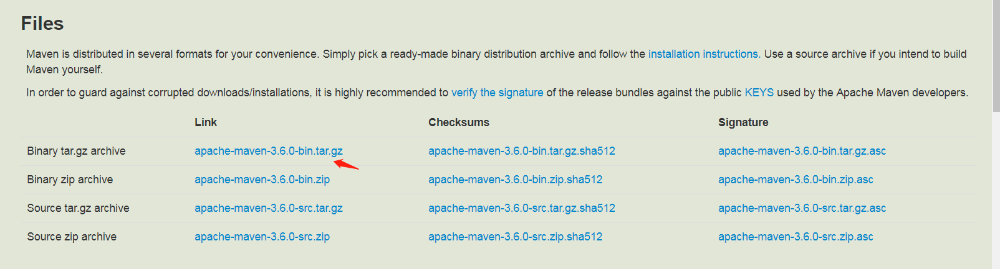

2.环境配置:

2.1.解压压缩包并新建本地仓库:

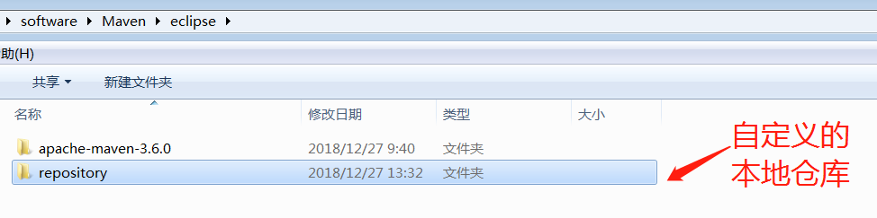

2.2.eclipse中添加自定义的:
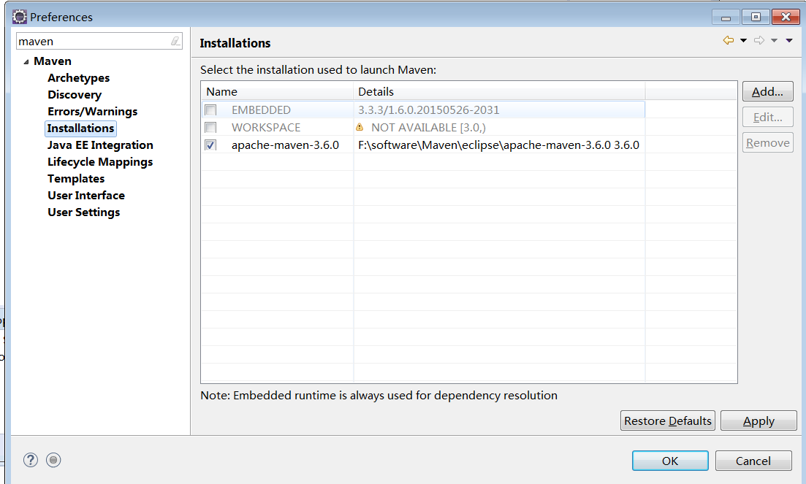

2.3.配置仓库地址:

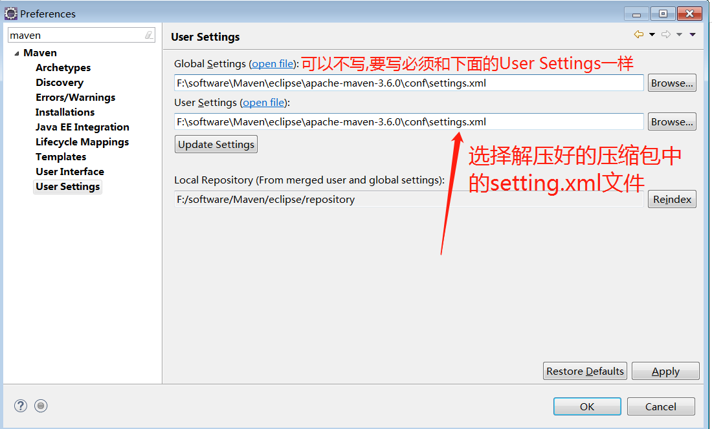

2.4.配置上面的setting.xml:
    2.4.1.添加本地自定义的仓库地址:

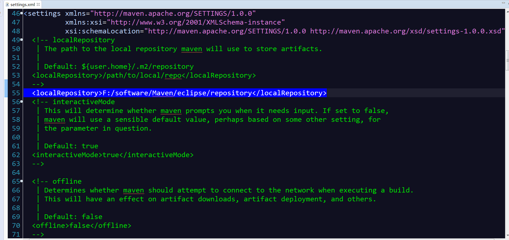
	
2.4.2.配置镜像地址(阿里云):

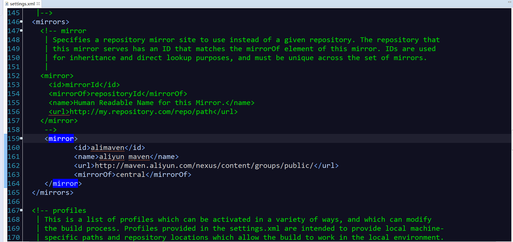

    <mirror>
           <id>alimaven</id>
           <name>aliyun maven</name>
           <url>http://maven.aliyun.com/nexus/content/groups/public/</url>
           <mirrorOf>central</mirrorOf>
    </mirror>

2.4.3.配置jdK版本(与本地的jdk版本一致): (profiles标签中配置)

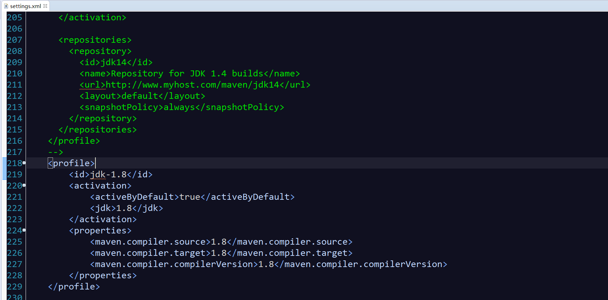

	   <profile>
	       <id>jdk-1.8</id>
	       <activation>
	           <activeByDefault>true</activeByDefault>
	           <jdk>1.8</jdk>
	       </activation>
	       <properties>
	           <maven.compiler.source>1.8</maven.compiler.source>
	           <maven.compiler.target>1.8</maven.compiler.target>
	           <maven.compiler.compilerVersion>1.8</maven.compiler.compilerVersion>
	       </properties>
       </profile>

4.简述一下war包项目的:

4.1.项目结构:
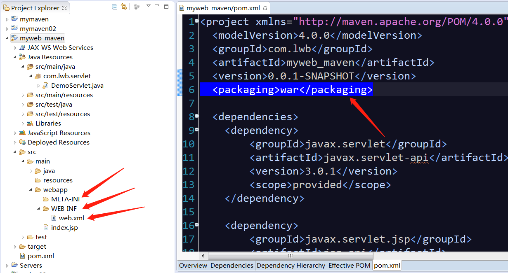

标准的war(web项目),必须有图中所标注的结构,否则右边的packaging会报错

4.2.引入必须的jar包:
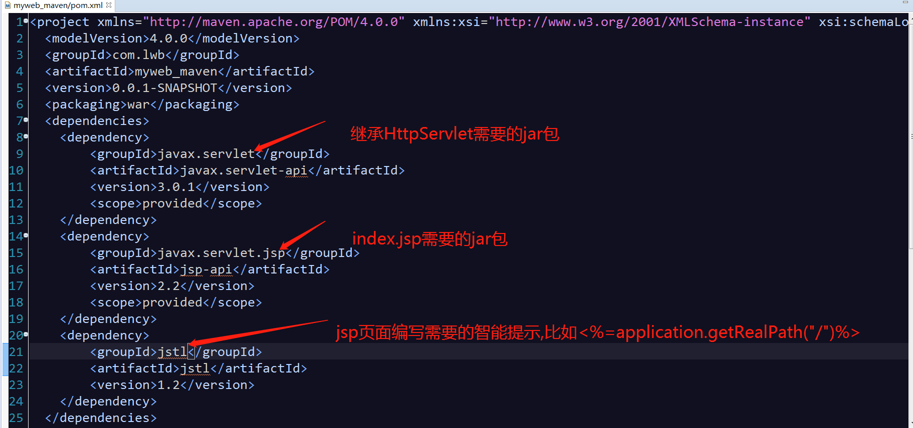

JSP 标准标签库(JSTL) JSP标准标签库(JSTL)是一个JSP标签集合,它封装了JSP应用的通用核心功能

4.3.配置build标签:即是tomcat插件引进:

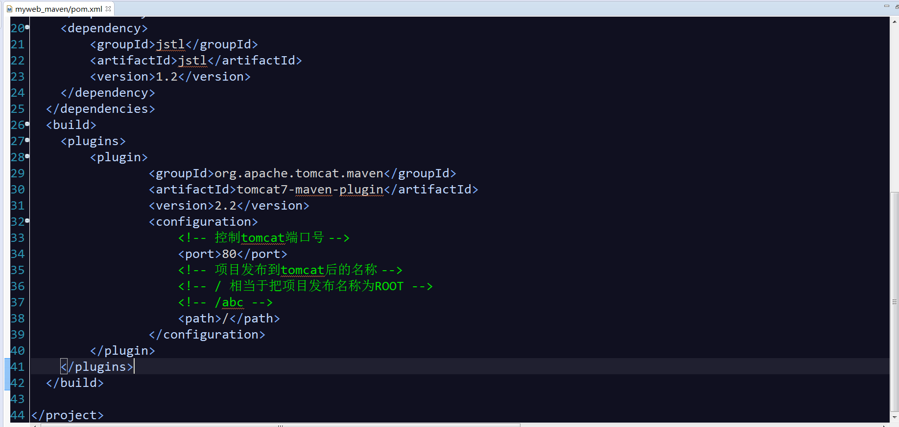

4.4.maven build: (发布项目): 项目右键,选择Run As --->Maven build

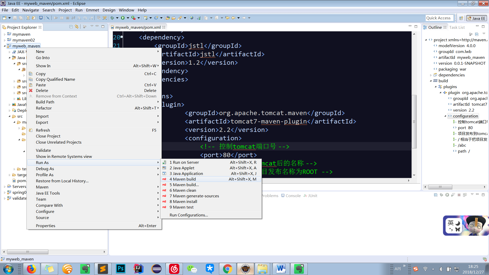

5.出现的问题:

问题1:
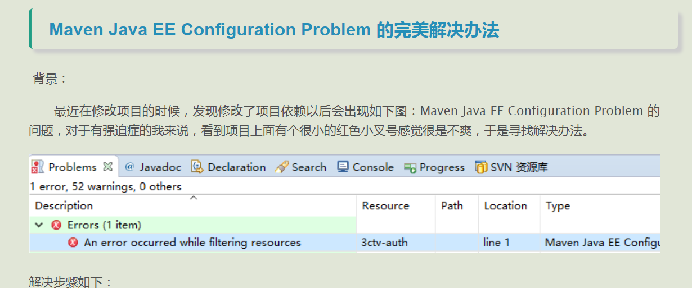

解决1:  ,点击项目右键maven-->update project-->选择对应项目

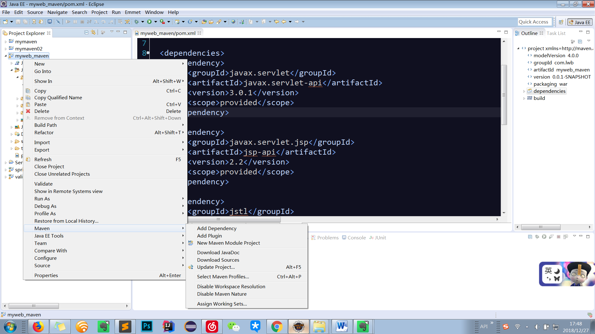
问题2:
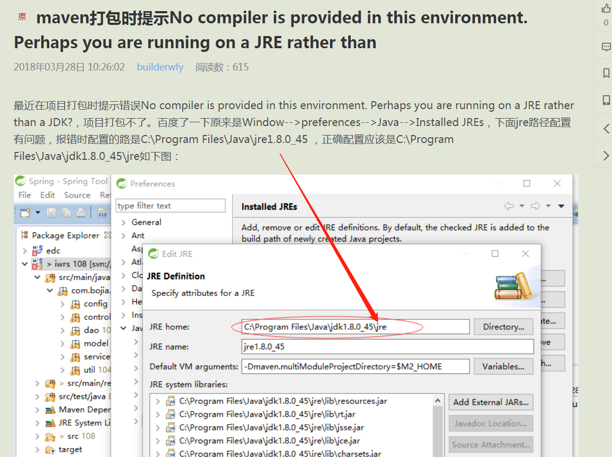

问题3:

	Servlet.service() for servlet [jsp] in context with path [/abc] threw exception 

	[java.lang.LinkageError: loader constraint violation: loader (instance of org/apache/

	jasper/servlet/JasperLoader) previously
	
	initiated loading for a different type with name "javax/servlet/http/

	HttpServletRequest"] with root cause java.lang.LinkageError: loader constraint 

	violation: loader (instance of org/apache/jasper/servlet/JasperLoader) previously
	
	initiated loading for a different type with name "javax/servlet/http/

	HttpServletRequest"

解决3:javax.servlet的jar包

加上scope标签 (scope表示范围是jar包在编译时候生成,不会被打包到tomcat)
    <dependency>
            <groupId>javax.servlet</groupId>
            <artifactId>javax.servlet-api</artifactId>
            <version>3.0.1</version>
            <!-- scope表示范围是jar包在编译时候生成,不会被打包到tomcat -->
            <scope>provided</scope>
    </dependency>

问题4:

	Failed to execute goal org.apache.maven.plugins:maven-clean-plugin:2.5:clean (default-

	clean) on project myweb1-maven:

	Failed to clean project: Failed to delete F:\software\Eclipse wp\myweb1-maven\target

	\tomcat\logs\access_log.2018-12-27 -> [Help 1]

解决4:
本来是执行clean tomcat7:run命令的，结果执行clean的时候就报错了，不能清除log,那就是log被某个程序占用了，所以不能清除，XX，刚刚启动的程序没有关闭，terminate.再次启动，ＯＫ了！

问题5:空指针异常

	Servlet.service() for servlet [jsp] in context with path [/] threw exception 

	[java.lang.NullPointerException] with root cause

	java.lang.NullPointerException

    at org.apache.jsp.index_jsp._jspInit(index_jsp.java:31)

解决5:javax.jsp,也是加上scope

    <dependency>
            <groupId>javax.servlet.jsp</groupId>
            <artifactId>jsp-api</artifactId>
            <version>2.2</version>
            <scope>provided</scope>
    </dependency>