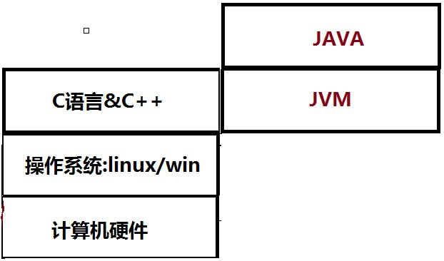
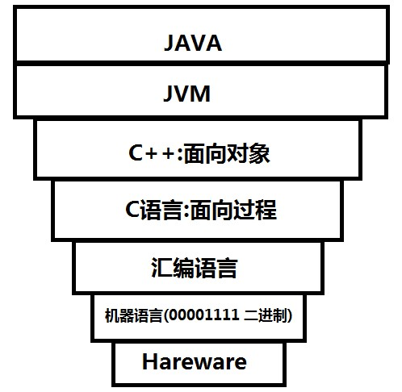
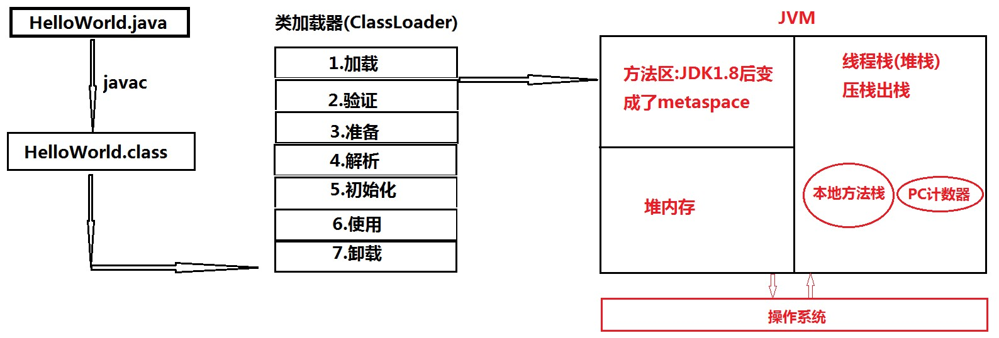
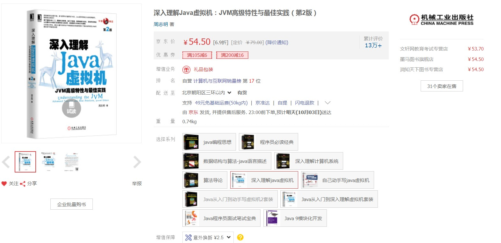

##JVM

>  啥是JVM啊:

   简点来说,就是Java内存模型

>  初识JVM

重新打印输出HelloWorld吧

>>回忆一下当初怎么运行的?

  首先,编译文件,即javac命令--->生成HelloWorld.class字节码文件

  接着,就是运行时刻--->java HelloWorld命令.输出"HelloWorld"

>>难道你不好奇这一简单过程,JVM到底干啥了吗??反正我想想就好奇,它是怎么知道的呢

  可能,这个时候,你可以想象你真的是刚接触Java,那么,你忍不住,为啥会有Java啊,为啥学Java啊,我怎么不学学C语言,C++呢(当然,感兴趣操作系统,可以深入研究)。

  来，我们画个图，看看呗，看看JVM到底能干嘛

  

  图示表达的,解释一下呗:

  好滴,浅显说两句: JVM 帮我们搞定了问题,是它在跟操作系统打交道,我们呢,只需要编写JAVA,编程产生的问题,JVM来解决----->从图中,我们也看出,对于不同操作系统,只需要安装不同的JVM即可,"write once,run everywhere"  (跨平台特性)

  
  再来个好看的图:

  

  简单看看:  编程语言不断更新的发展各阶段

  先了解C语言和C++:

  C语言关注的是数据的流向;

  C++和Java关注的是面向对象,不同对象之间的交互

  但是C++延续了C语言的一些诟病,比如直接操作内存、空间使用了忘记释放、编写难度大、使用容易出错。

  看到这里，你就不禁哇的一声，哇，java你终于来了！！！

*   来，开头含蓄已经讲完了，来聊聊最近我们过得好吗（那就是详细情况了）

>> 重新打印输出HelloWold吧

   看图吧,我觉得看图贼有意思,一目了然,至于文字,我们只需要看情调啦!!

   

   对,看完了图,我们发现有个叫类加载器的爷爷吧,它拥有七个葫芦娃,每个葫芦娃都有自己对应的功能

   好,我们来瞧瞧这七个的详细功能吧:

   * 1.加载:

     类加载过程的一个阶段：通过一个类的完全限定查找此类字节码文件，并利用字节码文件创建一个Class对象

   * 2.验证:

	 目的在于确保Class文件的字节流中包含信息符合当前虚拟机要求，不会危害虚拟机自身安全。主要包括四种验证，文件格式验证，元数据验证，字节码验证，符号引用验证。

   * 3.准备:

     为类变量(即static修饰的字段变量)分配内存并且设置该类变量的初始值即0
	 (如static int i=5;这里只将i初始化为0，至于5的值将在初始化时赋值)，这里不包含用final修饰的static，因为final在编译的时候就会分配了，注意这里不会为实例变量分配初始化，类变量会分配在方法区中，而实例变量是会随着对象一起分配到Java堆中

   * 4.解析:

     简单来个小例子:

	 例如声明对象,Hello h = new Hello();  左边为声明对象,右边为创建对象

     h即符号引用,解析呢,就是将h这种符号引用变为直接引用即内存地址。来两句官方点的：

     主要将常量池中的符号引用替换为直接引用的过程。符号引用就是一组符号来描述目标，可以是任何字面量，而直接引用就是直接指向目标的指针、相对偏移量或一个间接定位到目标的句柄。有类或接口的解析，字段解析，类方法解析，接口方法解析

   * 5.初始化：

     类加载最后阶段，若该类具有超类，则对其进行初始化，执行静态初始化器和静态初始化成员变量(初始化了默认值的static变量将会在这个阶段赋值，成员变量也将被初始化)。
	 

	这便是类加载的5个重要过程

   * 6.使用

   * 7.卸载

好了，就简单说说吧，说多了，你自己都懒得看书了。啊，有什么书吗？

当然，比如，这一本，就不错啦 ，《深入Java虚拟机》，需要更详细了解，可参考

   