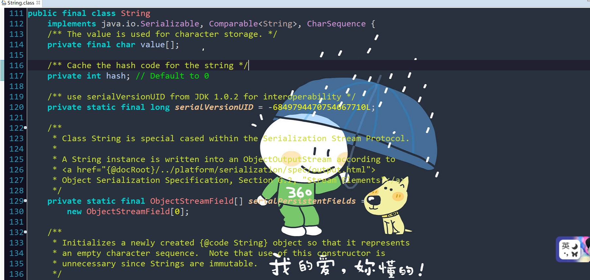
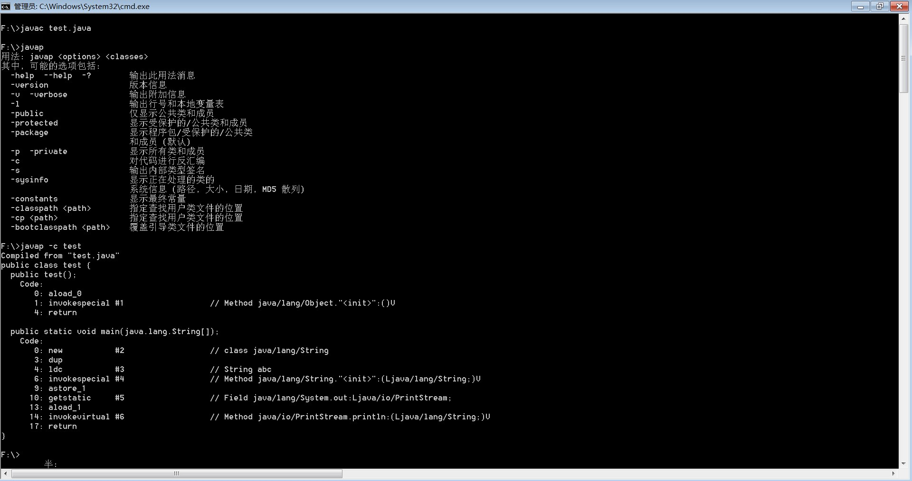
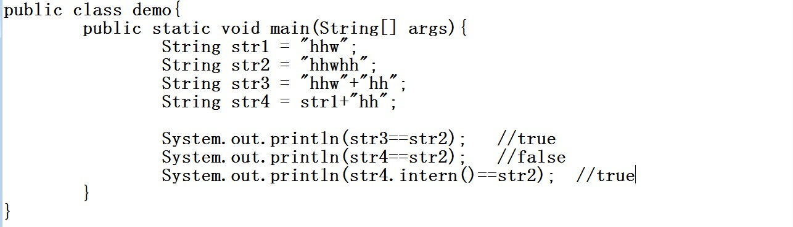
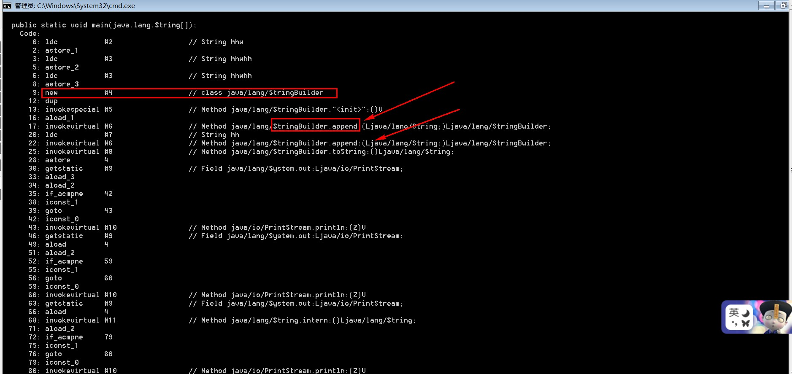
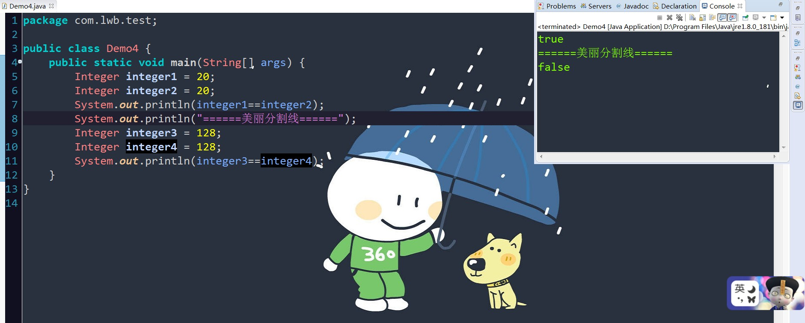

##String类

>> 既然提到了String类,想问,String类是基本数据类型吗? 当然不是!!

   这时,忍不住想起了八大基本数据类型,那就顺便了,顺便提一下这八大基本类型和他们的封装类

   首先,是哪八种基本数据库类型呢???

>   八种基本数据类型为:int,short,float,double,long,boolean,byte,char

>  封装类为:**Integer**,Short,Float,Double,Long,Boolean,Byte,**Character**

   也许,以前你学习面向对象时,总会看到一句经典的话"万事万物皆对象",所有对象的超类是Object类.
   
   此时,你不禁发问,八大基本类型是对象???  

   它们当然不是,这,这,矛盾了吧,又说万事万物皆对象....

   不是还有包装类吗(封装类Integer...Character)

   因为对基本数据类型封装之后，封装类有可以有方法和属性，然后就可以利用这些方法和属性来处理数据，
    
   比如Ingeter对象中有parseInt(String s)，可以把字符串转换为int类型等。我们都知道有些类型的数
 
   据会有默认值，基本数据类型跟封装类型的默认值是不一样的，比如int i  ，如果不赋值i默认为0；但

   是Integer j ，如果不赋值，则j 为null；因为封装类产生的是对象，而对象默认值为null。

   
*  想看看String类的源码,我也心动了,想看看吗,要不一起,好啊!

   

   哇,太多了,我看不过来啊...

   哎呀,你看那么多干嘛,你仔细观察,String类前面怎么有个final修饰呢???

   **原来,String类是final类，也即意味着String类不能被继承，并且它的成员方法都默认为final方法。**
   
   **在Java中，被final修饰的类是不允许被继承的，并且该类中的成员方法都默认为final方法。**

   
   这时,可能你对final修饰符又感兴趣了,好吧,下一节,我们来看看final关键字吧,看看被它修饰的类,成员

   方法,成员变量有啥特征。

###最后，看看博客们怎么写的吧,写的好详细,看完你差点就是大神了...

##转载:   [https://www.cnblogs.com/xiaoxi/p/6036701.html](https://www.cnblogs.com/xiaoxi/p/6036701.html)

###好了,期待下一节吧,既然看完这一节了,考考你呗:

* 问题一:   

   关于String str = new String("abc")这语句执行中创建了多少个对象？

   有时注意审题啊,是执行创建多少个对象还是涉及到多少个对象???

   自己动手测试一下,反编译一下(javap -c 文件名) , 看看调用多少次new

   

* 问题二:
  
  看图,解释一下输出结果:

  
  
  反编译看看吧,观察一下:

  

  intern方法,是啥啊,我隐约记得,它的设计初衷是重用String对象 , 节省内存消耗,详情可以看看JVM知识

* 问题三:前面讲到八大基本类型的包装类,那就问个Integer的:

  以下输出结果呢:

  

  赶紧解释啊,为啥啊?

  你别心急嘛,听我慢慢说啦:

    Integer的值在-128到127时，Integer对象是在IntegerCache.cache产生，会复用已有对象，
   
    也就是说，这个区间的Integer可以直接用等号进行判断。Integer的值在-128到127之外时，
    
    Integer对象在堆上产生，不会复用已有对象，用等号会返回false。建议老老实实用equals()

    方法来比较Integer对象。

  这下就明白了吧