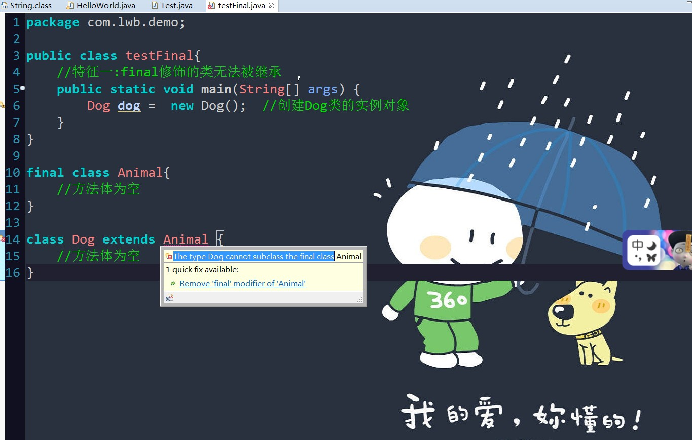
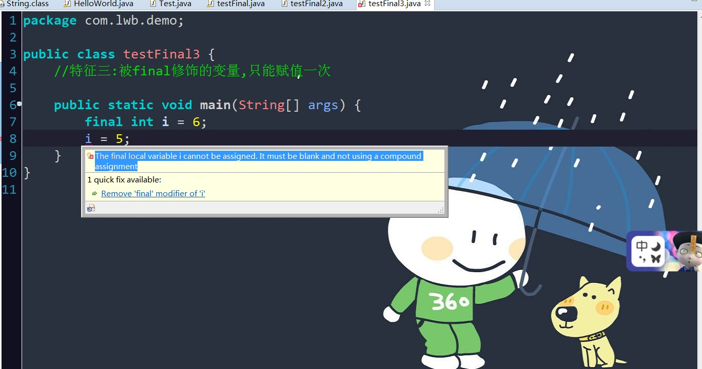

##聊聊final关键字

>  什么是final关键字啊

   final关键字可用于修饰类、变量和方法,它呢,有"这是无法改变的"或者"最终"的含义

   因此,被final修饰的类、变量和方法将具有以下的特征:

   1.final修饰的类不能被继承,

   2.final修饰的方法不能被子类重写,

   3.final修饰的变量(成员变量和局部变量)是常量,只能赋值一次

口说无凭啊,我们来验证试试吧!

* 特征一:

  

由此可见,被final关键字修饰的类为最终类,不能被其他类继承

* 特征二:

  

* 特征三:

  

>>  引荐大佬的,讲得不错,该有都有:

##   [http://www.cnblogs.com/dolphin0520/p/3736238.html](http://www.cnblogs.com/dolphin0520/p/3736238.html)