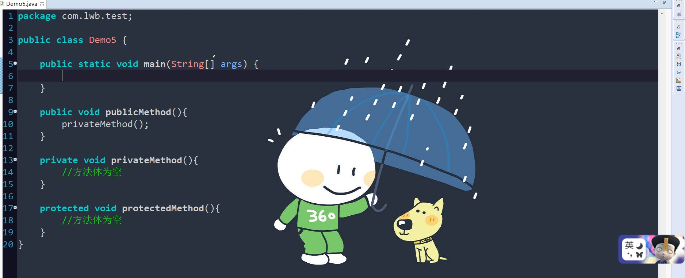
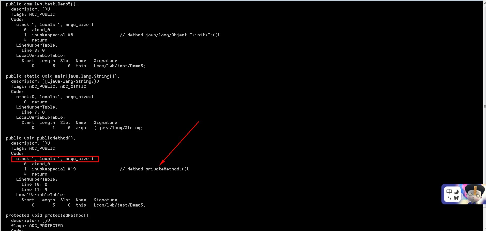
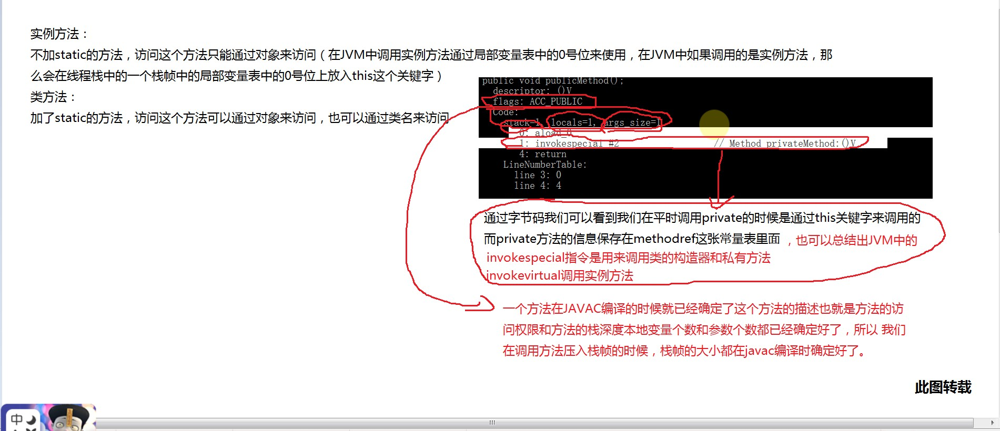
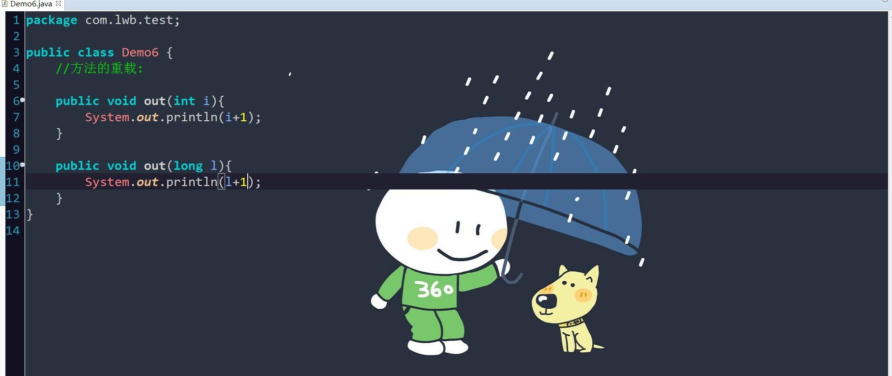
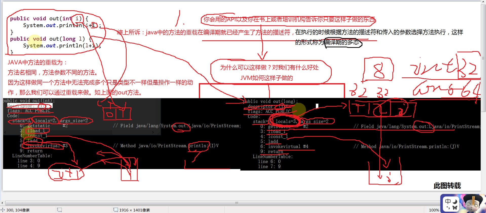

##啥叫讲点有意思的啊

   就是干货理解,干不干,你自己看着办吧

   首先,讲点访问修饰符,可能少见吧

   java中public、private、protected区别:

   类中的数据成员和成员函数据具有的访问权限包括：public、private、protect、friendly（包访问权限）

 
   1、public：public表明该数据成员、成员函数是对所有用户开放的，所有用户都可以直接进行调用

   2、private：private表示私有，私有的意思就是除了class自己之外，任何人都不可以直接使用，私有财产神圣不可侵犯嘛，即便是子女，朋友，都不可以使用。

   3、protected：protected对于子女、朋友来说，就是public的，可以自由使用，没有任何限制，而对于其他的外部class，protected就变成private。

   在初学Java的时候，都不会提访问权限和修饰符的问题，在Java的学习中一般都要到包的概念学完才会涉及访问控制：

      priavte          本类可见

      public           所有类可见

      protected        本包和所有子类都可见（本包中的子类非子类均可访问，不同包中的子类可以访问，不是子类不能访问）

      friendly         本包可见（即默认的形式）（本包中的子类非子类均可访问，不同包中的类及子类均不能访问）

 

*  看点不一样代码:

    

    
    关键来了,执行命令 javap -verbose Demo5 看看

    

    干不干???

    干,就喝水啊! 如下水源图

    

*  再来看一下:方法的重载:(重载:方法名相同,参数不同)
  
   

   还是反编译看看:

   
   

*   真的是干货啊,我还是买一杯营养快线吧!太渴了......