##JSP知识学习啦

来来来,划重点了,在WEB开发项目中JSP占据举足轻重的地位,JSP虽然简单,但是灰常重要啊!

首先,不问啥是JSP,问,为啥学习JSP,JSP用来弄啥子的呢???

学习JSP之前,想必你已经学习了Servlet,在学习后,可能你也发现了,在页面展现的时候,使用servlet进行代码的

书写是过于麻烦! 这时,为了提高开发的效率,能像以前进行网页编程一样,就不得不使用JSP技术了!!!!

>> JSP简介:

JSP 全名为Java Server Pages，中文名叫java 服务器页面，其根本是一个简化的Servlet设计，它是由Sun

Microsystems 公司倡导、许多公司参与一起建立的一种动态网页技术标准。(动态与静态的区别,并不是说页

面呈现的图片动态,指的是数据动向,可能不同人、不同时候访问网页,显示内容不同)。 重点,JSP本质Servlet !

* 特点:

本质上还是Servlet

跨平台，一次编写处处运行

组件跨平台

健壮性和安全性

* 访问原理:

浏览器发起请求,请求JSP,请求被Tomcat服务器接收,执行JspServlet将请求的JSP文件转译成为对应的java文件

(也就是Servlet),然后执行转义好的java文件.(也就是说当你编写好的jsp文件,发起请求时,tomcat根本就不认

识,只认识Servlet).

上图,来感受一下,在项目WebContent目录下,新建accessPrinciple.jsp(访问原理)文件,访问项目

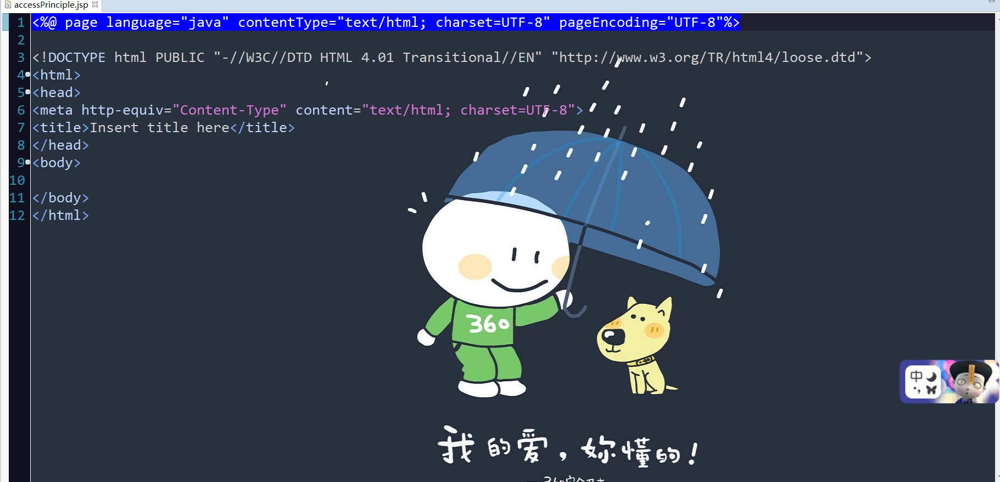

查看jsp文件编译后的类文件:

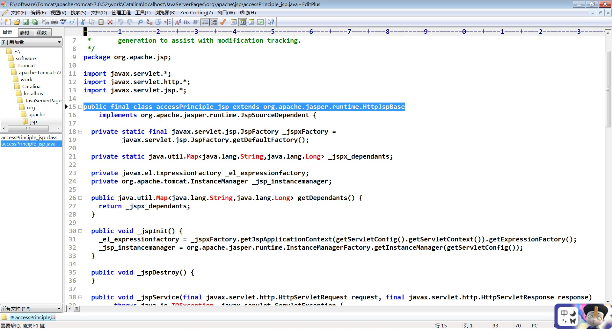

可见,继承与HttpJspBase(打开tomcat目录下的lib,点击jasper.jar包--利用反编译工具jd-gui)

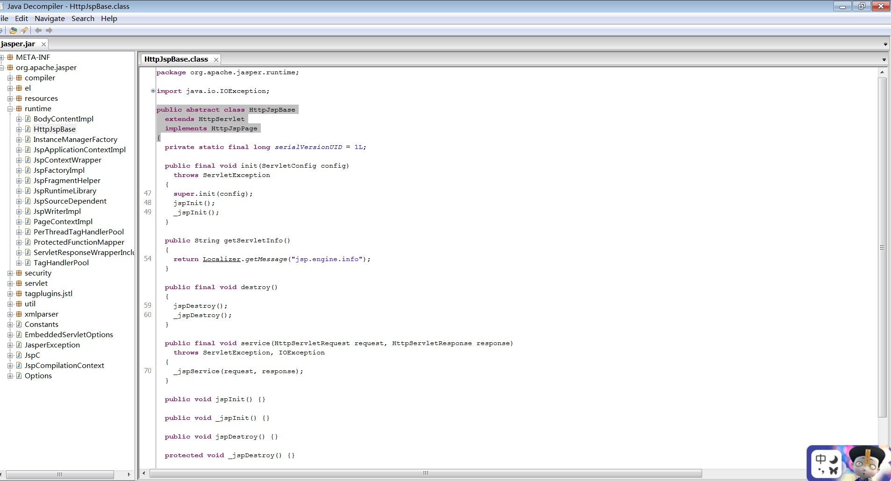
 
跟我们以前写的Servlet一样,继承与HttpServlet(本质就是Servlet)

**转载博客文章:**

(图解JSP运行原理和过程) 

##  [https://blog.csdn.net/oncealong/article/details/51393266](https://blog.csdn.net/oncealong/article/details/51393266)

* JSP注释问题:

a. html注释

<!--注释内容-->
这种注释会在jsp文件编译后出现在java类文件。 (会被转译，也会被发送，但是不会被浏览器执行)

b.jsp注释

<%--注释内容--%>

这种注释是jsp特有的注释，是供项目开发团队交流使用，不会出现在jsp编译之后的java类文件，更加不会出现在

浏览器！

c.jsp中的代码注释（可以理解就是平常java代码的注释）

//单行注释
/*........*/多行注释

这种注释也会出现在jsp文件编译后的类文件中  (会被转译，但是不会被servlet执行)

---------------------
上图来看看吧:图示写上html注释格式/JSP特有的注释格式

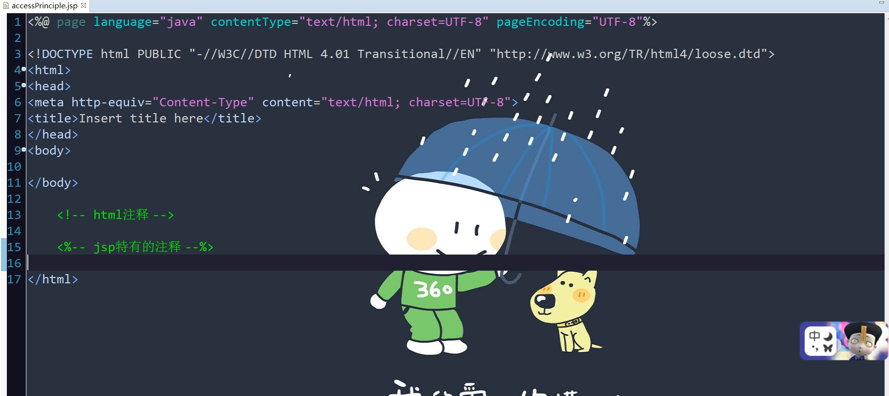

现在找jsp文件编译后的类文件:

此路径:
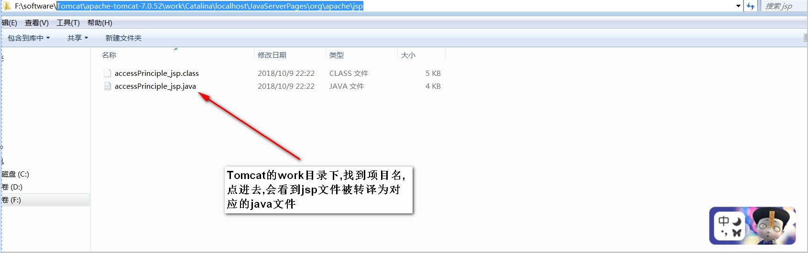

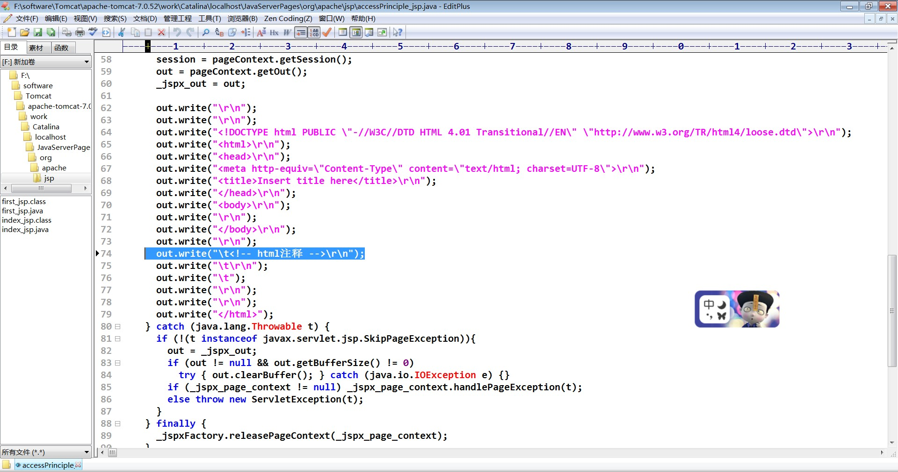

结果呢,很明显,html注释会出现在jsp文件编译后的类文件中,而JSP独有的注释则不会。

* Jsp的page指令学习

代码如下

	<%@ page language="java" import="java.util.*,java.lang.*" pageEncoding="utf-8" contentType="text/html; charset=utf-8"%>

	<%@page session="true" %>

	<%@page errorPage="error.jsp"  %>

	<%@page isErrorPage="true" %>

<%@page 属性名="属性值" 属性名="属性值"...%>

	language：声明jsp要被转译的语言。

	import:声明转译的java文件要导入的包，不同的包使用逗号隔开。

	pageEncoding:设置jsp文件的数据编码格式。

	contentType="text/html; charset=utf-8" 设置jsp数据响应给浏览器时，浏览器的解析和编码格式。

	session:设置转译的servlet中是否开启session支持,默认开启，true表示开启。false表示关闭。

	errorPage:设置jsp运行错误跳转的页面.

	extends:设置jsp转译的java文件要继承的父类(包名+类名)。
	
	作用：
		配置jsp文件的转译相关的参数。

* JSP的局部代码块:

代码如下:

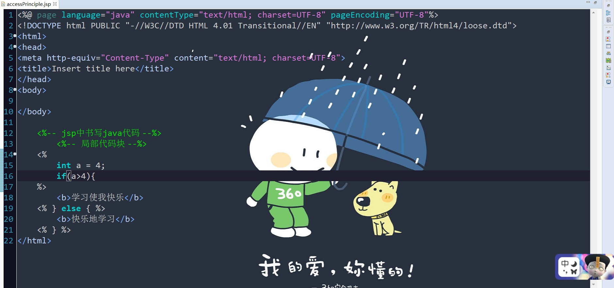

查看编译后的类文件:

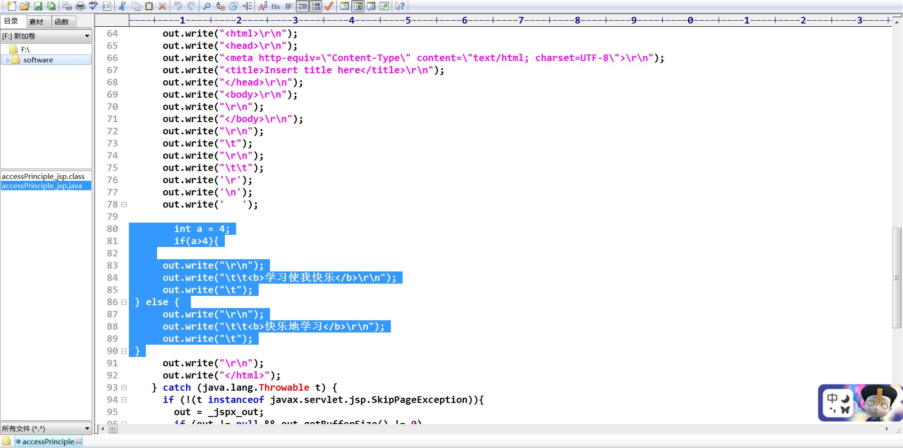

转译后就是java语句

>  特点:

    局部代码块中声明的java代码会被原样转译到jsp对应的servlet文件的_JspService方法中。代码块中声明的变量都是局部变量。

>  使用格式:

	<% java代码 %>

>  缺点:

    使用局部代码块在jsp中进行逻辑判断,书写麻烦,阅读困难。

>  实际开发：

    servlet进行请求逻辑处理,使用进行页面的展现

* JSP的全局代码块:

代码如下:

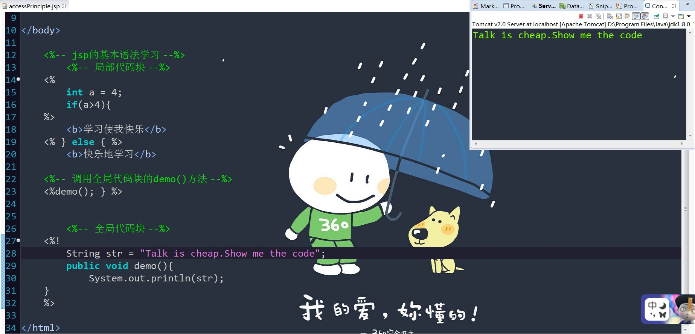

查看编译后的类文件:

全局代码块编写的java语句

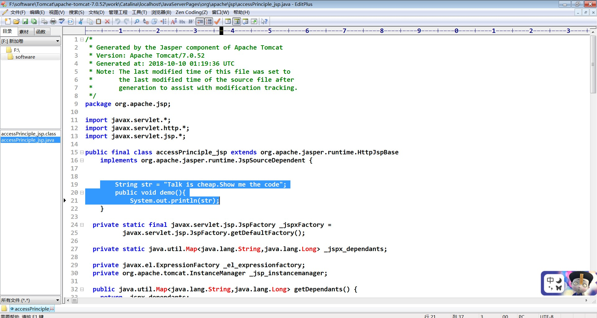

局部代码块调用全局代码块的demo()方法

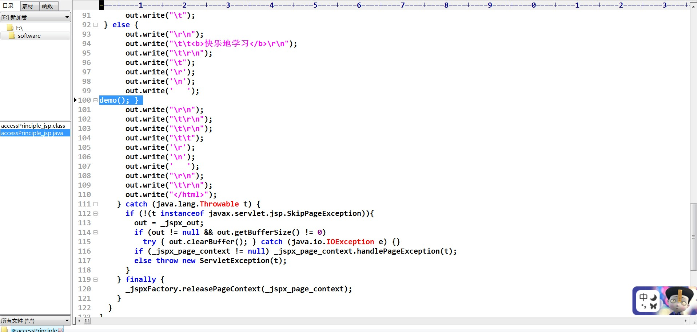

>   特点:

	声明的java代码作为全局代码转译到对应的servlet类中。

>   使用格式:

	<%! 全局代码 %>

>   注意:

	全局代码块声明的代码,需要使用局部代码块调用。

* JSP的脚本段语句:

代码如下:

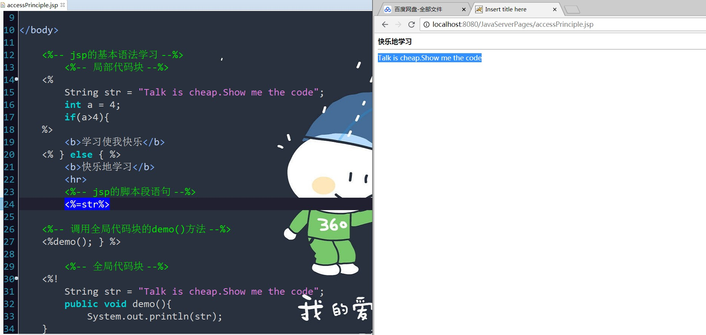

查看编译后的类文件:

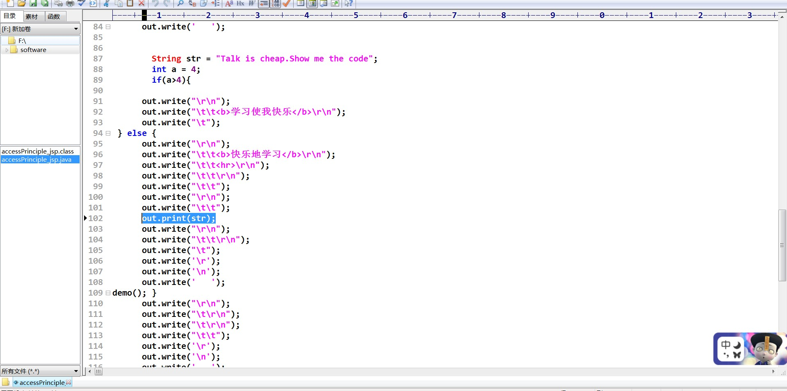

注意观察

>   特点:

	帮助我们快速的获取变量或者方法的返回值作为数据响应给浏览器

>   使用格式:

	<%=变量名或者方法%>

>   注意:

	不要在变量名或者方法后使用分号

>   位置:

	除jsp语法要求以外的任意位置。

* JSP的静态引入和动态引入：

代码如下:

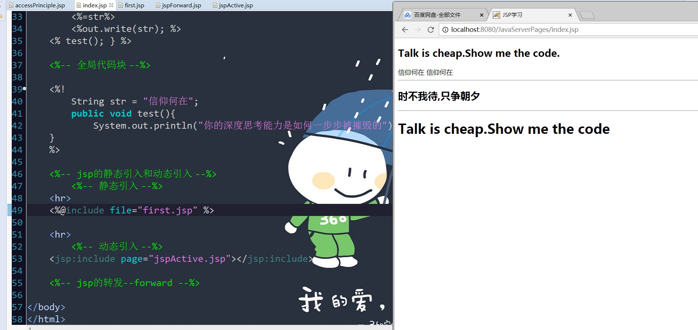

>>  静态引入:

   特点:

    会将引入的jsp文件和当前的jsp文件转译成一个java(Servlet)文件使用。在网页中也就显示了合并后的显示效果。

   使用格式：
  
    <%@include file="要引入的jsp文件的相对路径" %>

   注意:

	静态引入的jsp文化不会单独转译成java(Servlet)文件。当前文件和静态引入的jsp文件中不能够使用java代码块声明同名变量。

>>  动态引入:

   特点:

	会将引入的jsp文件单独转译，在当前文件转译好的java文件中调用引入的jsp文件的转译文件。在网页中显示合并后的显示效果。

   使用格式:

    <jsp:include page="要引入的jsp文件的相对路径"></jsp:include>

   注意:

    动态引入允许文件中声明同名变量。
   

* JSP的转发标签forward：

代码如下:

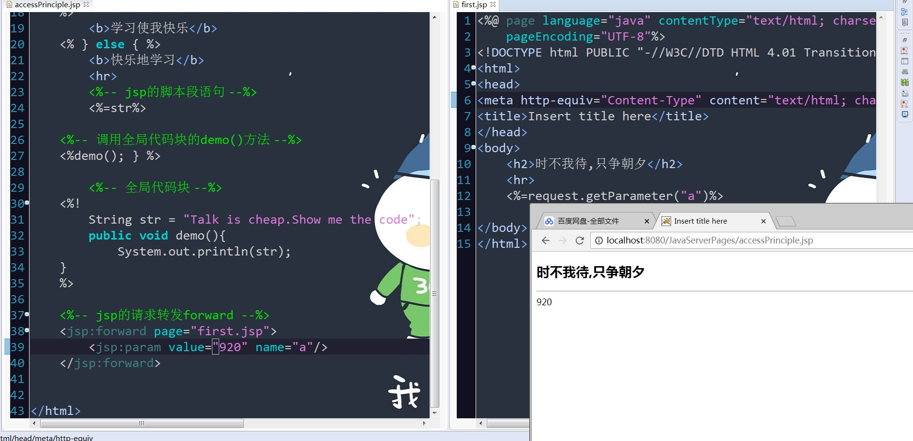

>  特点:

    一次请求地址栏信息不改变。

>  使用格式:

    <jsp:forward page="要转发的jsp文件的相对路径"></jsp:forward>

>  注意:

    在转发标签的两个标签中间除了写<jsp:param name="str" value="aaa" />子标签不会报错，

    其他任意字符都会报错。

	<jsp:param name="str" value="aaa" />name属性为附带的数据的键名,value为附带的数据内容(键值对)
	
    注意：会将数据以？的形式拼接在转发路径的后面。(可用request对象获取存储的数据)

* JSP九大内置对象和四种属性范围:

>> 先说说四种属性范围:

在JSP中提供了四种属性保存范围

	page：在一个页面内保存属性，跳转之后无效

	request：在一次服务请求范围内，服务器跳转后依然有效

	ession：-在一次会话范围内，无论何种跳转都可以使用，但是新开浏览器无法使用

	application：在整个服务器上保存，所有用户都可以使用

1.page范围:

自己看代码总结一下:

新建pageTest.jsp,编写内容如下:

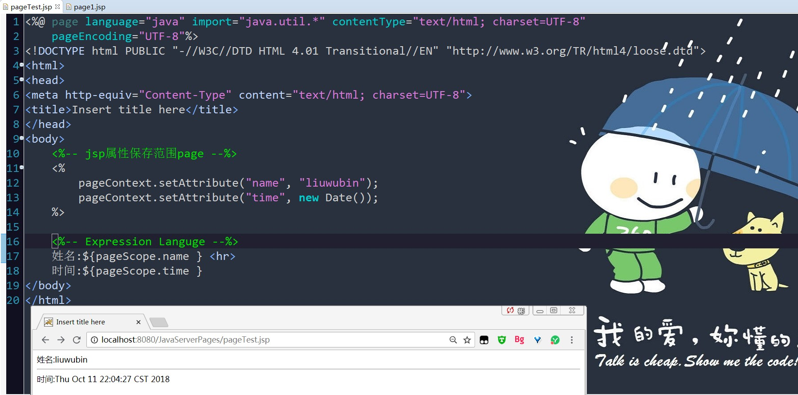

新建page1.jsp,看看能不能获取pageTes.jsp的属性值

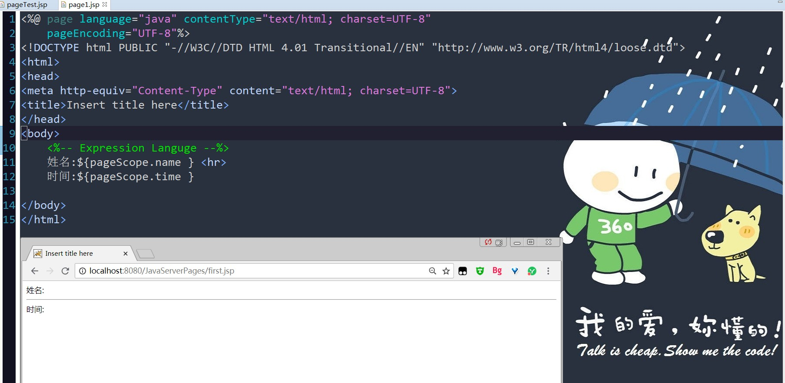

2.request范围:

新建request.jsp和跳转的页面requestResult.jsp编写内容如下

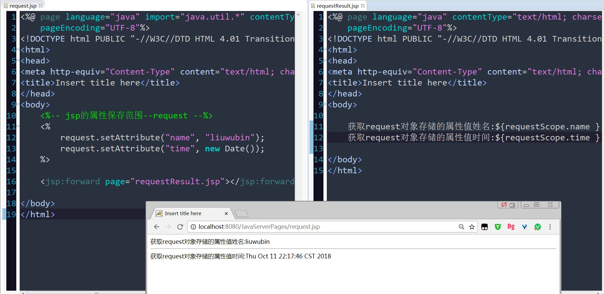

再新建request1.jsp:

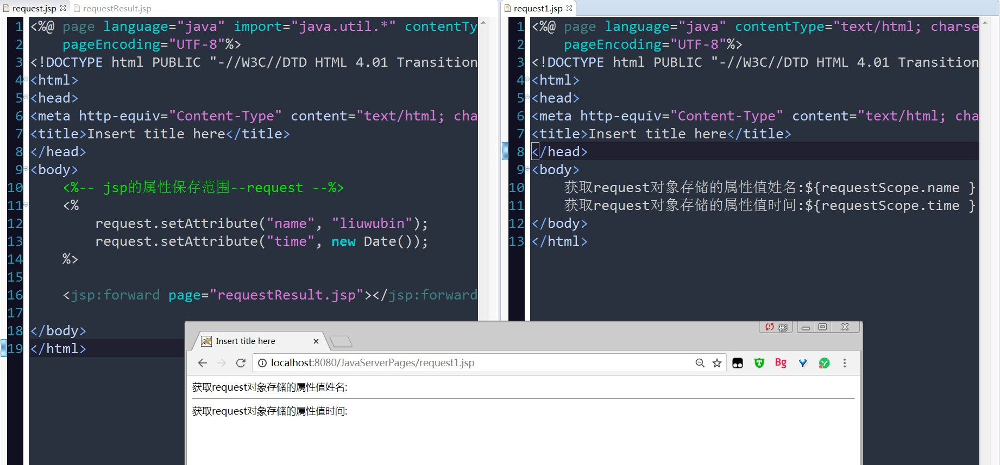

3.session范围:

新建session.jsp和sessionResult.jsp 文件,编写内容如下
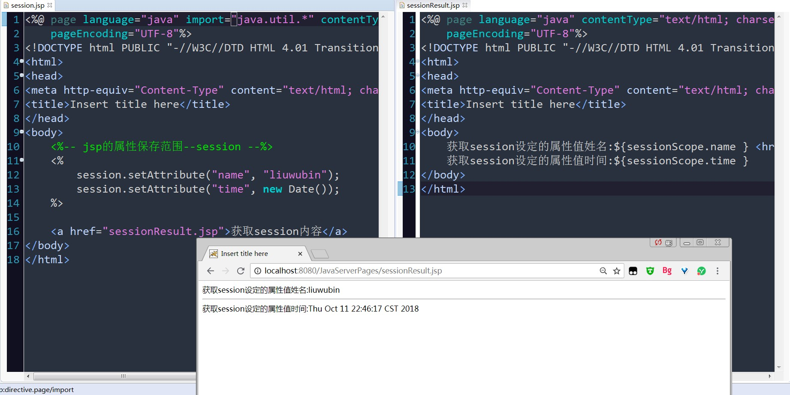

再新建session1.jsp:
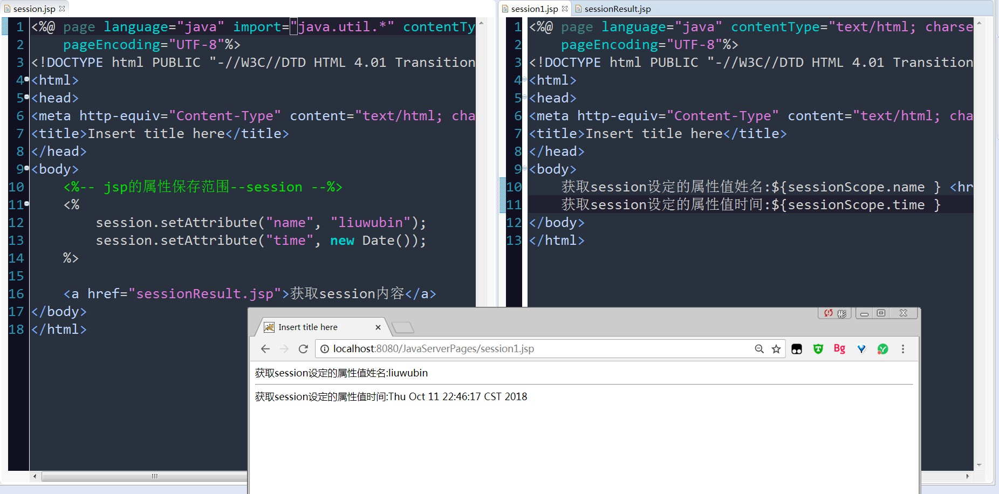

4.application范围:

新建application.jsp和applicationResult.jsp文件,编写内容如下:

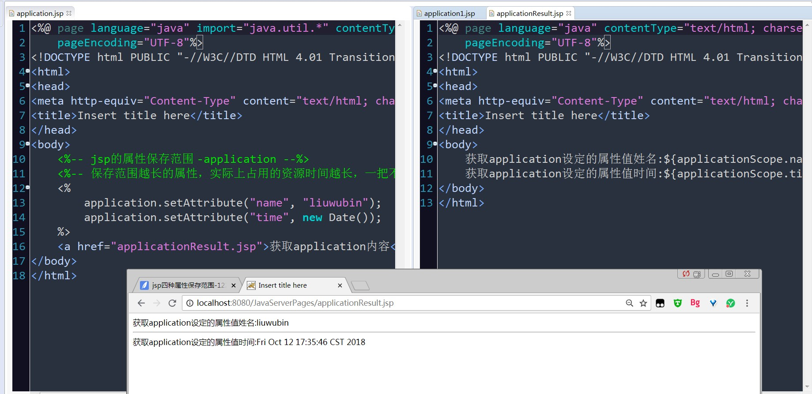

再新建application1.jsp
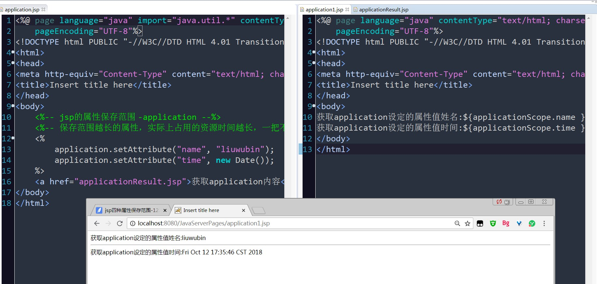

##总结:

	总结：application、session、request、都需要跨多个页面，属性保存是由内存开销的，设置过多的

    application或每一个session保存过多的对象，则性能会降低，因此，如果能使用request就不要使用

    session，能使用session就不要使用application。以上四种属性范围都是依靠pageContext展开的。

##借鉴博客们大神的文章,多看看,挺不错的:

(Servlet/JSP基础指南):

## [https://www.kancloud.cn/evankaka/servletjsp/119655  ](https://www.kancloud.cn/evankaka/servletjsp/119655  )

(JSP的属性保存范围图解):

## [http://blog.51cto.com/12222886/1900166 ](http://blog.51cto.com/12222886/1900166 )

>>  JSP九大内置对象详解:

参照以上链接,很详细的解释

##注意:

1.Jsp的路径：

		在jsp中资源路径可以使用相对路径完成跳转，但是：
			问题一：资源的位置不可随意更改。
			问题二：需要使用../进行文件夹的跳出。使用比较麻烦。
		使用绝对路径：(必须会)
			/虚拟项目名/项目资源路径
			例如：
					<a href="/jsp/jspPro.jsp">jspPro.jsp</a>
					<a href="/jsp/a/a.jsp">a.jsp</a> 
			注意：在jsp中资源的第一个/表示的是服务器根目录，相当于:localhost:8080
		使用jsp中自带的全局路径声明：(MyEclipse中的,新建jsp文件自带的)
			<%
				String path = request.getContextPath();
				String basePath = request.getScheme()+"://"+request.getServerName()+":"+request.getServerPort()+path+"/";
			%>
			<base href="<%=basePath%>">
			作用：
				给资源前面添加项目路径：		http://127.0.0.1:8080/虚拟项目名/上	

2.修改jsp页面为什么不用重启Tomcat:

## [https://blog.csdn.net/m0_37836194/article/details/76953475](https://blog.csdn.net/m0_37836194/article/details/76953475)