#信息管理系统

##技术需求:

*	Servlet + JSP+MVC+JDBC

##软件需求:

*	开发工具:Eclipse(jdk1.8)

*	数据库:  MySql(可视化SQLyog)

*	服务器:  tomcat7.0

*	浏览器:Google,Firefox(方便调试,建议火狐)

##硬件需求:

*	一台个人电脑

##功能需求:

*	完成用户登录

*   完成用户注册

*	完成用户退出

*	完成查看个人信息

*	完成修改密码

*	完成查询所有用户信息

##数据库设计:

*	创建用户表

	表名:t_user

	表设计:

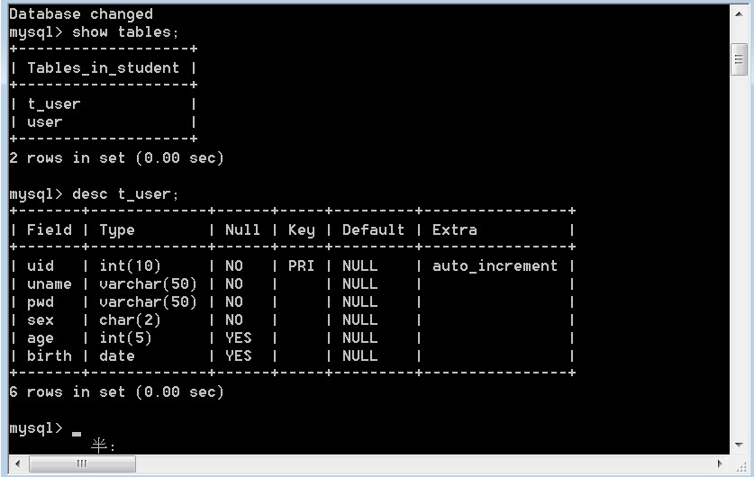

##代码规范:

*	命名规范:

	包名:com.lwb.*

	类名:首字母大写,见名知意

	变量名和方法名:驼峰原则,见名知意

*	注释规范:

	方法功能注释

	方法体核心位置必须有说明注释

*	日志规范:

>> 使用log4j进行日志输出(可选,本次使用)

##(日志参数详解) [https://www.cnblogs.com/ITtangtang/p/3926665.html](https://www.cnblogs.com/ITtangtang/p/3926665.html)

	本次操作:

	日志包+日志配置文件

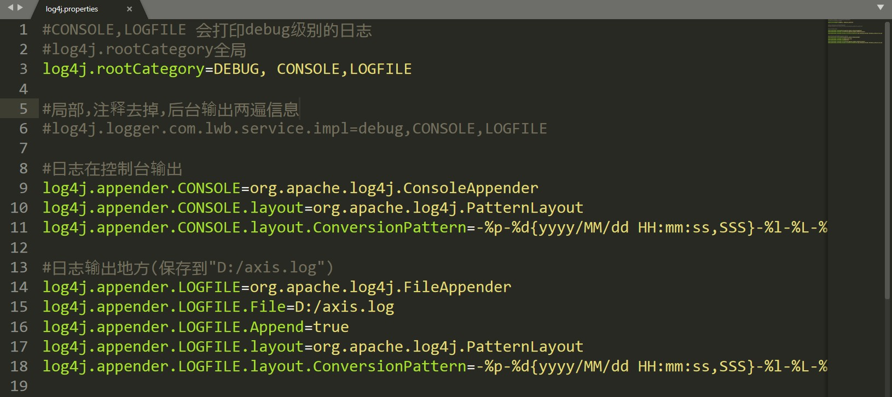

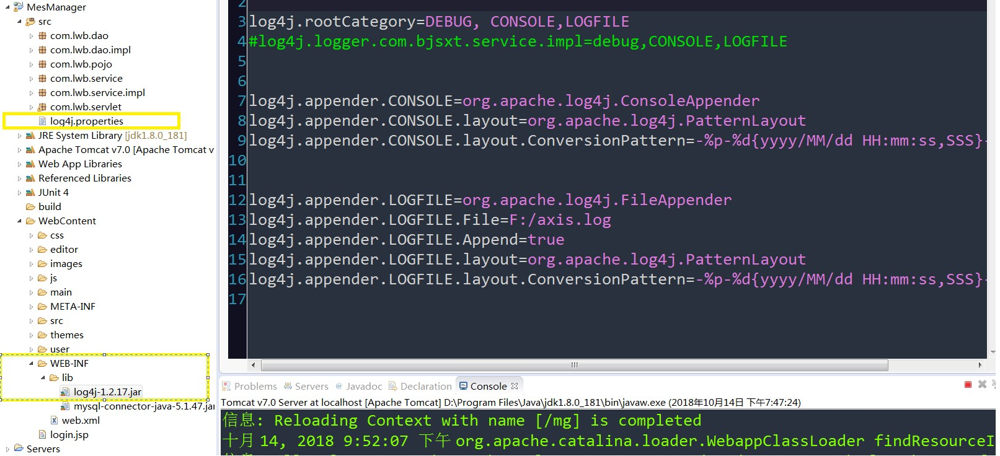

>> 数据流转的位置必须有后台输出语句.

##功能设计:

*	用户登录:

	创建登录页面

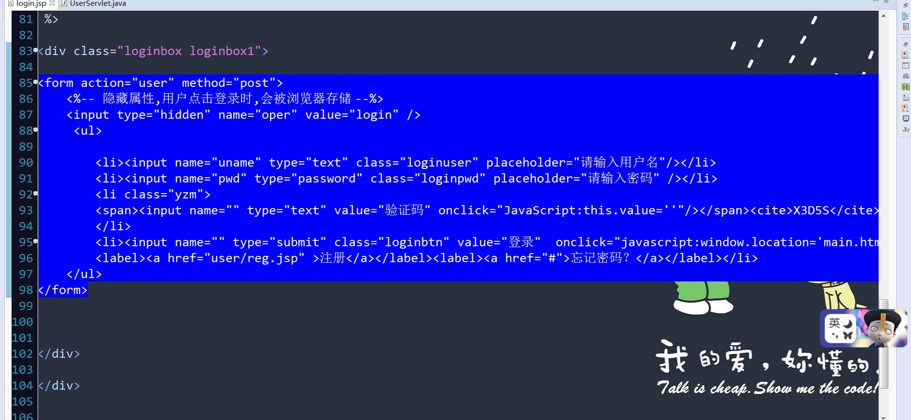

>> 问题:表单一submit提交,action地址(user)-->>UserServlet (这时会考虑到提交过来处理是登录功能,还是注册,退出等功能)

	解决:

	可在form表单中加入如下:

	<%-- 隐藏属性,用户点击登录时,会被浏览器存储 --%>
    <input type="hidden" name="oper" value="login" />

>> 问题:登录,输入用户名或密码错误时的提示:

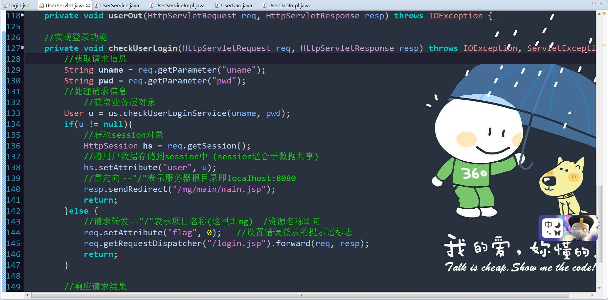

上图重点,看清楚了

*	用户注册

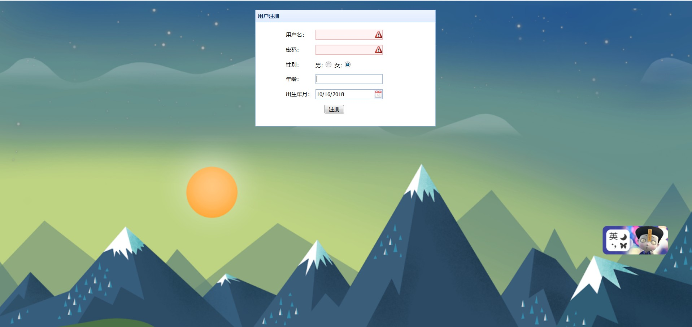

	<tr>
	<td>年龄:</td>
	<td><input id="age" onkeyup="this.value=this.value.replace(/[^\d]/g,'') " onafterpaste="this.value=this.value.replace(/[^\d]/g,'')" name="age" class="easyui-validatebox textbox" value=""></td>
	这里的年龄设定了,只能输入数字
	</tr>
	<tr>
	<td>出生年月:</td>
	<td><input name="birth" class="easyui-datebox textbox" value=<%=new SimpleDateFormat("yyyy/MM/dd").format(new Date())%> ></td>
	</tr>

	<!-- 声明jQuery代码域 -->
	

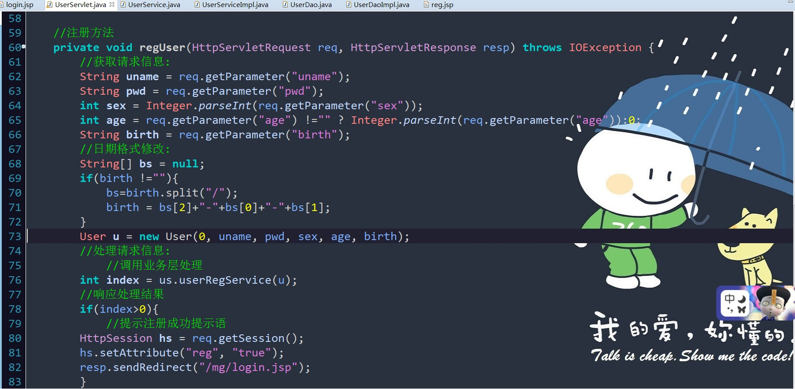

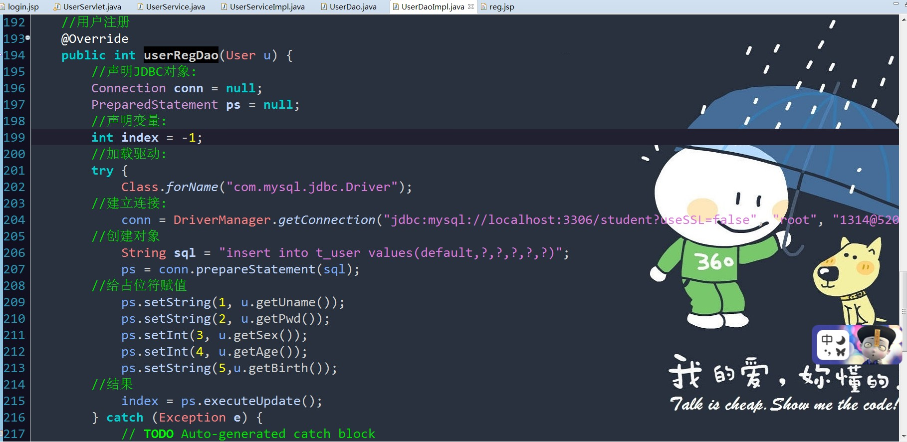

*	用户退出

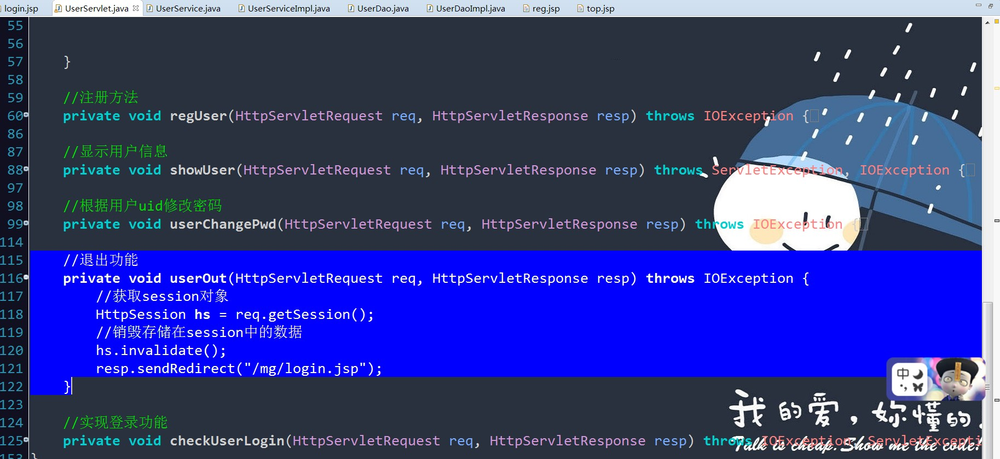

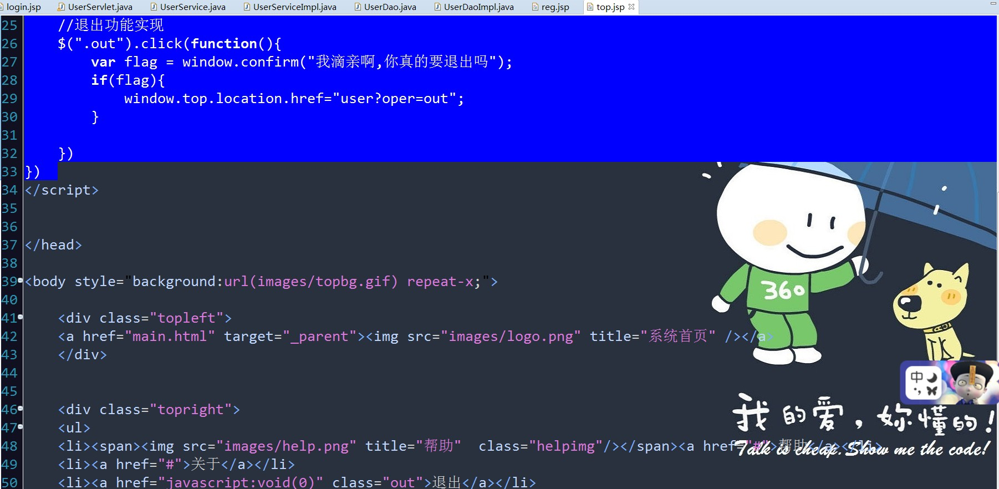

*	修改密码:

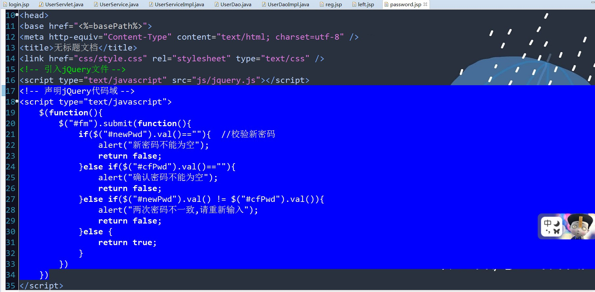

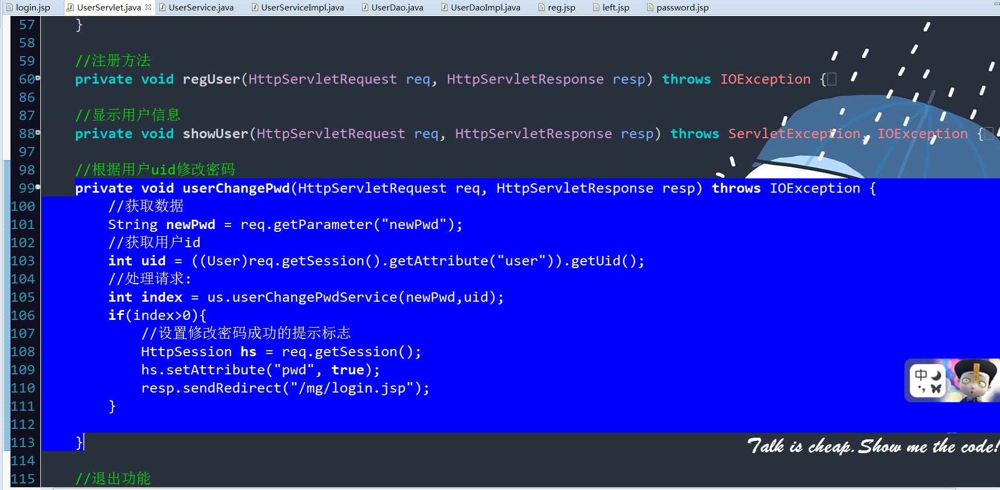

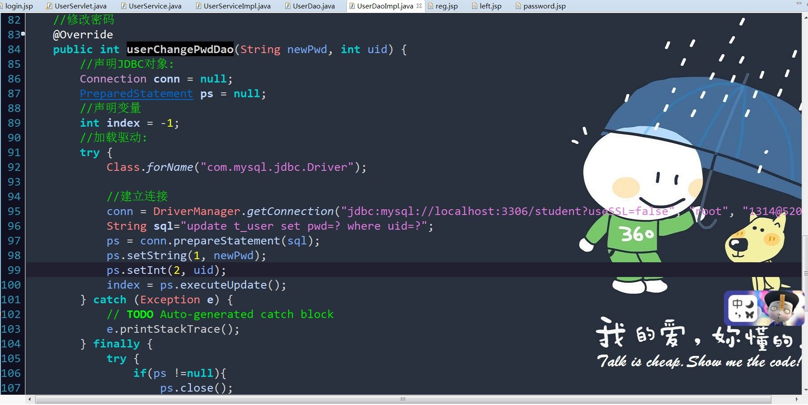

*	查看个人信息:

		if(u != null){
			//获取session对象
			HttpSession hs = req.getSession();
			//将用户数据存储到session中  (session适合于数据共享)
			hs.setAttribute("user", u);
			//重定向 --"/"表示服务器根目录即localhost:8080
			resp.sendRedirect("/mg/main/main.jsp");
			return;
		}else {
			//请求转发--"/"表示项目名称(这里即mg)  /资源名称即可		
			req.setAttribute("flag", 0);   //设置错误登录的提示语标志
			req.getRequestDispatcher("/login.jsp").forward(req, resp);
			return;
		}

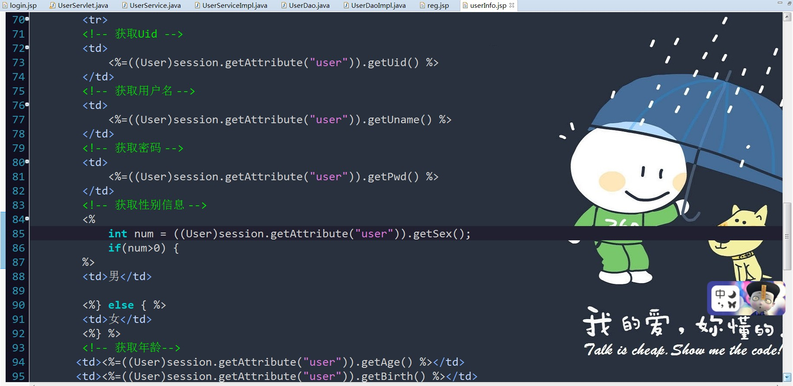

*	查看所有用户信息:

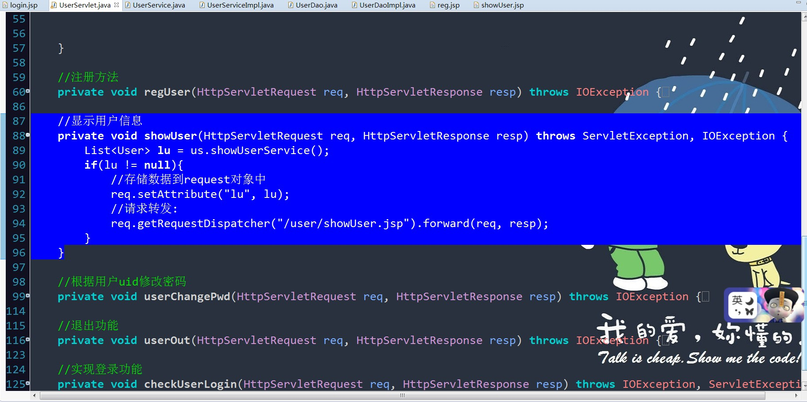

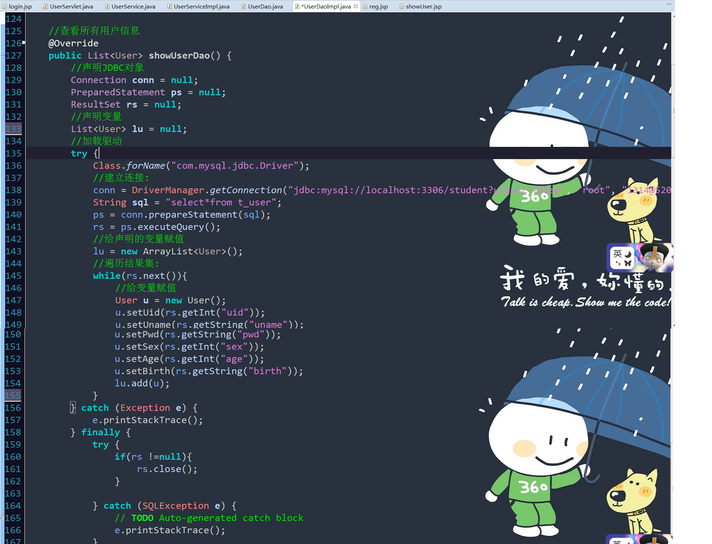

###总结问题:

>>  项目路径问题:

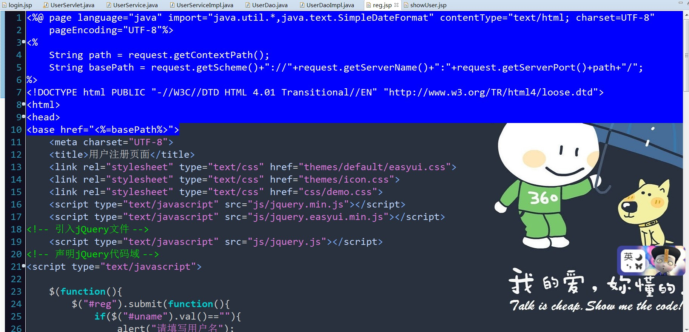

jsp文件中:

	<%@ page language="java" import="java.util.*,java.text.SimpleDateFormat" contentType="text/html; charset=UTF-8"
    pageEncoding="UTF-8"%>

	<%
	String path = request.getContextPath();
	String basePath = request.getScheme()+"://"+request.getServerName()+":"+request.getServerPort()+path+"/";
	%>

	<!DOCTYPE html PUBLIC "-//W3C//DTD HTML 4.01 Transitional//EN" "http://www.w3.org/TR/html4/loose.dtd">
	<html>
	<head>
	<base href="<%=basePath%>">	
	<meta charset="UTF-8">
	</head>

-------------------------------------------------------------------------------------------

请求转发和重定向:

		if(u != null){
			//获取session对象
			HttpSession hs = req.getSession();
			//将用户数据存储到session中  (session适合于数据共享)
			hs.setAttribute("user", u);
			//重定向 --"/"表示服务器根目录即localhost:8080
			resp.sendRedirect("/mg/main/main.jsp");
			return;
		}else {
			//请求转发--"/"表示项目名称(这里即mg)  /资源名称即可		
			req.setAttribute("flag", 0);   //设置错误登录的提示语标志
			req.getRequestDispatcher("/login.jsp").forward(req, resp);
			return;
		}	

>>  日志打印问题:

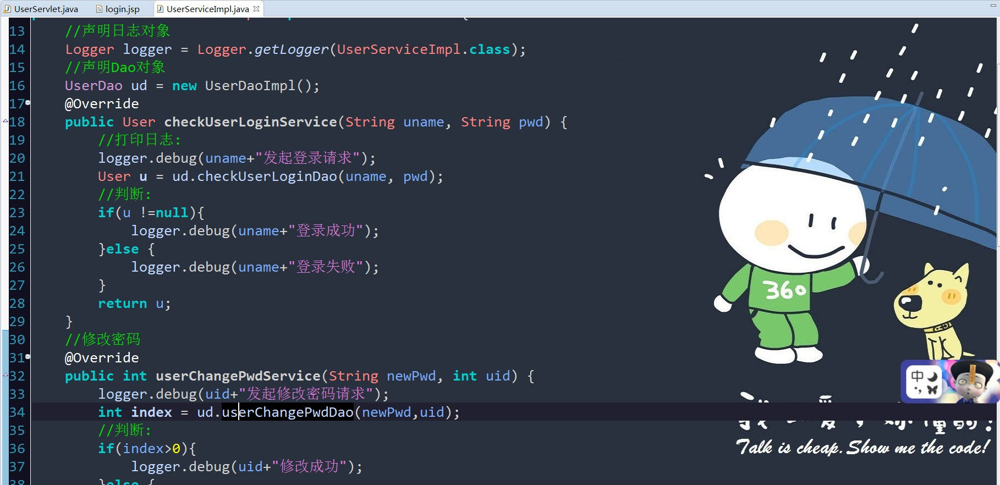