#AJAX = Asynchronous JavaScript and XML

*	Ajax的概念:

	即异步的JavaScript和XML,查一下它的解释吧!(首先我们得明确为啥用到Ajax,有啥优点之类..)

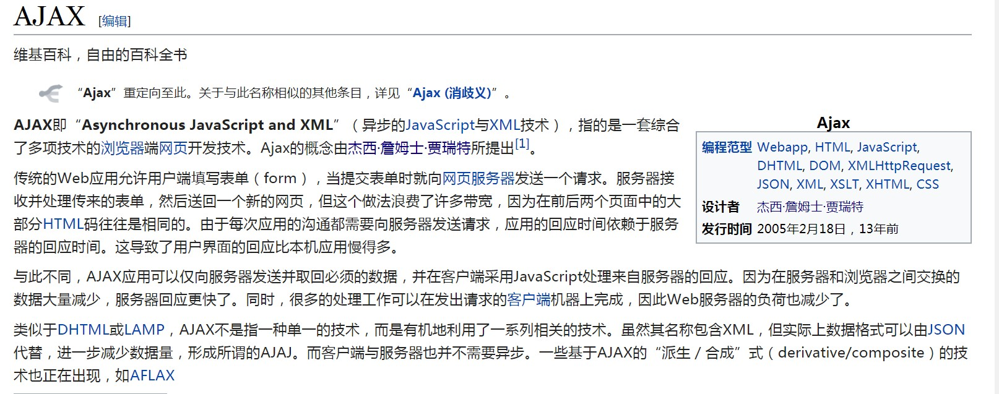

简单来说就是:

Ajax不是新的编程语言,而是一种使用现有的标准的新方法。

Ajax最大的优点是在不重新加载整个页面的情况下,可以与服务器交换数据并更新部分网页内容。

Ajax不需要任何浏览器插件,但是需要用户允许JavaScript在浏览器上执行。

*	Ajax工作原理

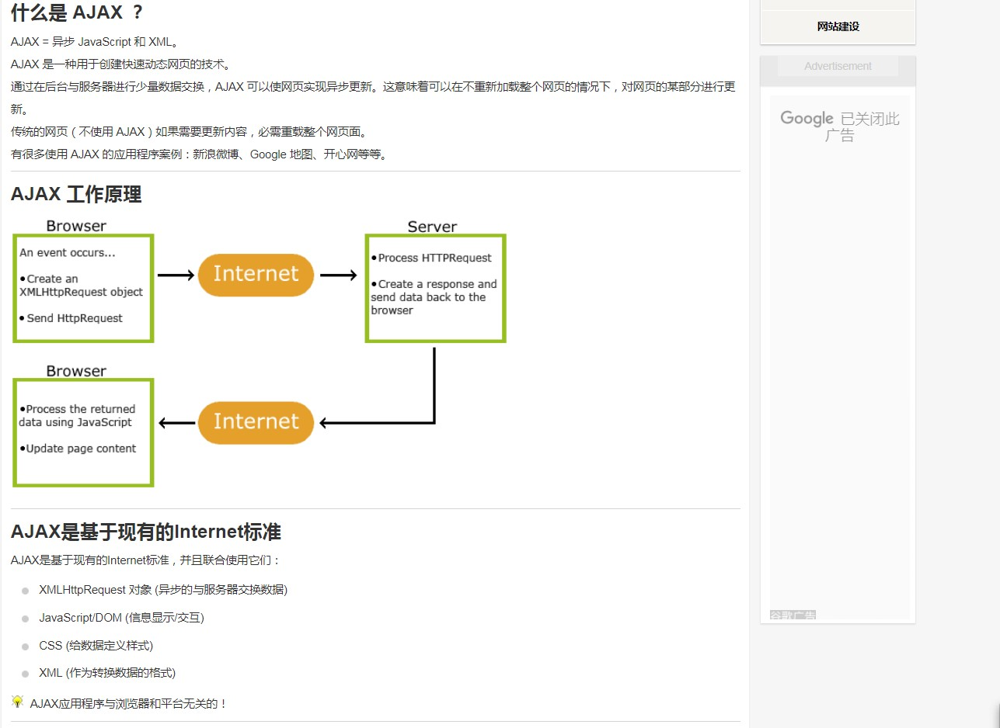

*	Talk is cheap.Show me the code(码上行动,看实例,见真我!)

##  [http://www.runoob.com/try/try.php?filename=tryajax_first](http://www.runoob.com/try/try.php?filename=tryajax_first)

*	看完例子了吧,可以自己线上修改玩玩:

>>总结流程:

	Ajax学习：
	1、ajax的概念
		局部刷新技术。不是一门新技术，是多种技术的组合。是浏览器端的技术。
	2、ajax的作用
		实现在当前结果页中显示其他请求的响应内容
	3、ajax的使用
		ajax的基本流程
			//(1).创建ajax引擎对象
			//(2).复写onreadystatement函数
				//判断ajax状态码
					//判断响应状态码
						//获取响应内容(响应内容的格式)
							//普通字符串：responseText
							//json(重点)：responseText
								其实就是讲述数据按照json的格式拼接好的字符串，方便使用eval方法
								将接受的字符串数据直接转换为js的对象
									
								json格式：
									var 对象名={
											属性名:属性值,
											属性名:属性值,
											……
										}
									
								//XML数据：responseXML.返回document对象
									通过document对象将数据从xml中获取出来
							//处理响应内容(js操作文档结构)
			//(3).发送请求
				//get请求
					get的请求实体拼接在URL后面，？隔开，键值对
					ajax.open("get","url");
					ajax.send(null);
				//post请求
					有单独的请求实体
					ajax.open("post", "url");
					ajax.setRequestHeader("Content-Type","application/x-www-form-urlencoded");
					ajax.send("name=张三&pwd=123");
			ajax的状态码
				ajax状态码:
					readyState：0,1,2,3,4
						4: 表示响应内容被成功接收
				响应状态码:
					status
					200:表示一切OK
					404:资源未找到
					500：内部服务器错误
			ajax的异步和同步
				ajax.open(method,urL,async)
				async：设置同步代码执行还是异步代码执行
					  true代表异步，默认是异步
					  false代表同步

详解步骤:

(1).创建ajax引擎对象(创建XMLHttpRequest对象)

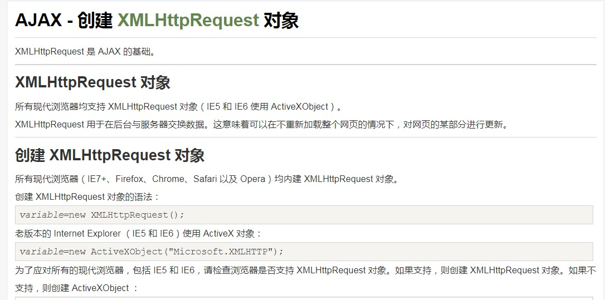

	实例:
	var xmlhttp;
	if (window.XMLHttpRequest)
	{
    //  IE7+, Firefox, Chrome, Opera, Safari 浏览器执行代码
    xmlhttp=new XMLHttpRequest();
	}
	else
	{
    // IE6, IE5 浏览器执行代码
    xmlhttp=new ActiveXObject("Microsoft.XMLHTTP");
	}

(2).复写回调函数onreadystatechange

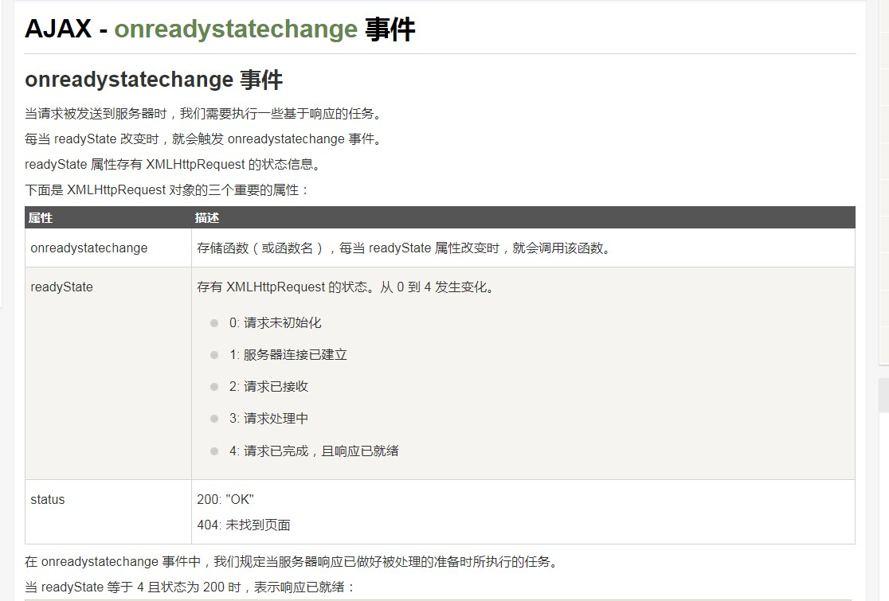

实例代码:

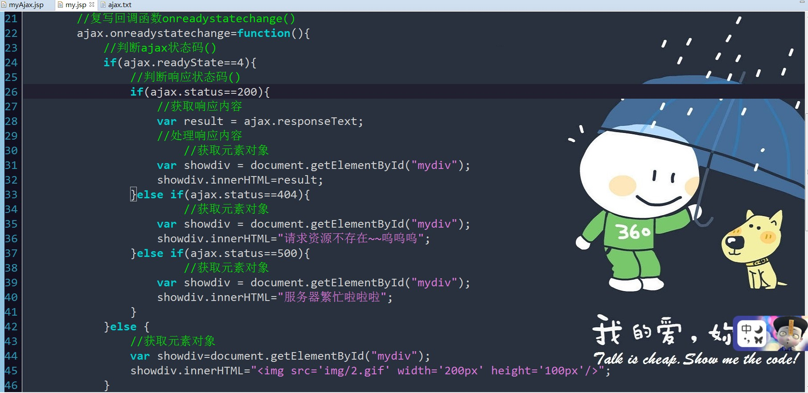

!!! 注意： onreadystatechange 事件被触发 4 次（0 - 4）, 分别是： 0-1、1-2、2-3、3-4，对应着 readyState 的每个变化。

(3).发送请求:

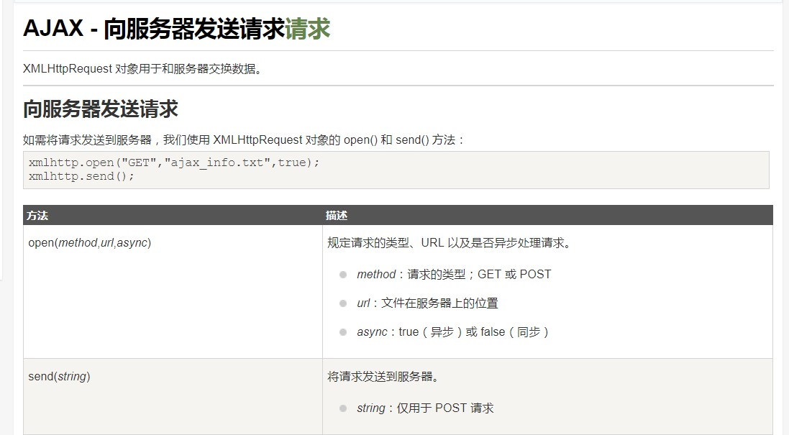

##GET 还是 POST？

	与 POST 相比，GET 更简单也更快，并且在大部分情况下都能用。

		然而，在以下情况中，请使用 POST 请求：
	
		*	无法使用缓存文件（更新服务器上的文件或数据库）
	
		*	向服务器发送大量数据（POST 没有数据量限制）
	
		*	发送包含未知字符的用户输入时，POST 比 GET 更稳定也更可靠

!!Attention:(注意啦)

如果需要像 HTML 表单那样 POST 数据，请使用 setRequestHeader() 来添加 HTTP 头。然后在 send() 方法中规定您希望发送的数据：

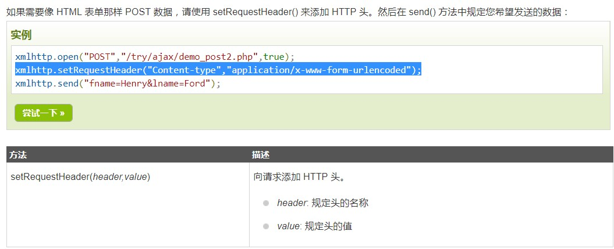

请求方法open(参数)详解:

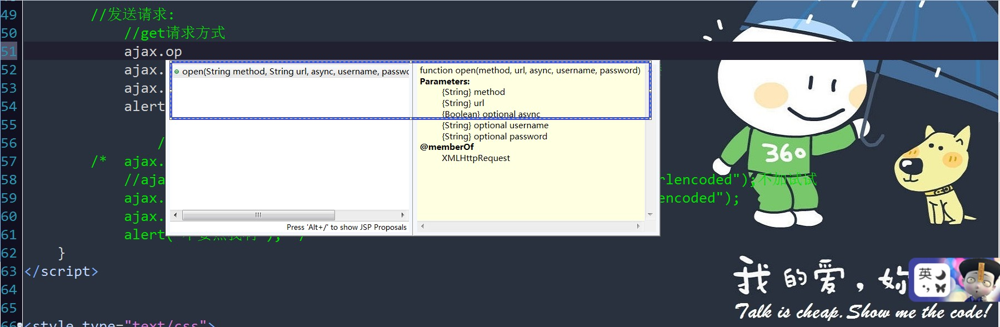

①请求方式("GET" /"POST")

②url:

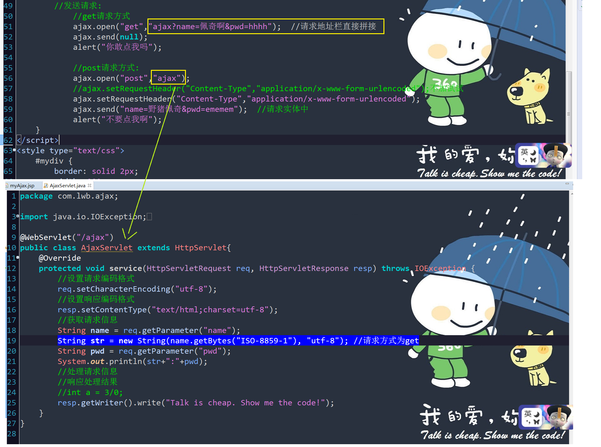

解释注解问题:

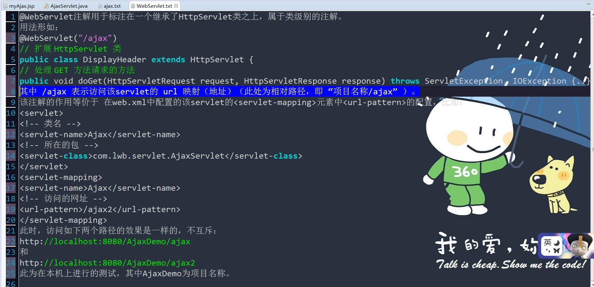

###url - 服务器上的文件
open() 方法的 url 参数是服务器上文件的地址：

	xmlhttp.open("GET","ajax_test.html",true);

该文件可以是任何类型的文件，比如 .txt 和 .xml，或者服务器脚本文件，比如 .asp 和 .php （在传回响应之前，能够在服务器上执行任务）。

③参数async(默认是true,即异步)

###异步 - True 或 False？ 

AJAX 指的是异步 JavaScript 和 XML（Asynchronous JavaScript and XML）。

XMLHttpRequest 对象如果要用于 AJAX 的话，其 open() 方法的 async 参数必须设置为 true：

	ajax.open("GET","ajax?name=佩奇啊&pwd=hhhh",true);
对于 web 开发人员来说，发送异步请求是一个巨大的进步。很多在服务器执行的任务都相当费时。AJAX 出现之前，这可能会引起应用程序挂起或停止。

通过 AJAX，JavaScript 无需等待服务器的响应，而是：(给力啊)

	 *	在等待服务器响应时执行其他脚本
	
	 *	当响应就绪后对响应进行处理

(代码演示一下):

①设置为默认值的true  (alert()警示框测试)

		//发送请求:	
		  	//get请求方式
			ajax.open("get","ajax?name=佩奇啊&pwd=hhhh",true); 
		//请求地址栏直接拼接  这里把false写错了,刚开始真没发现,最后Firefox调试发现了(不过一般显示就很明显,注意)
			ajax.send(null);
			alert("根据asyn的设置值,注意我弹出顺序"); ----------------- -- (注意)

		//复写回调函数onreadystatechange()
	 	ajax.onreadystatechange=function(){
			//判断ajax状态码()
			if(ajax.readyState==4){
				//判断响应状态码()
				if(ajax.status==200){
					//获取响应内容
					var result = ajax.responseText;
					alert(result);   -------------------- --------------(注意)
					//处理响应内容
						//获取元素对象
					var showdiv = document.getElementById("mydiv");
					showdiv.innerHTML=result;
				}

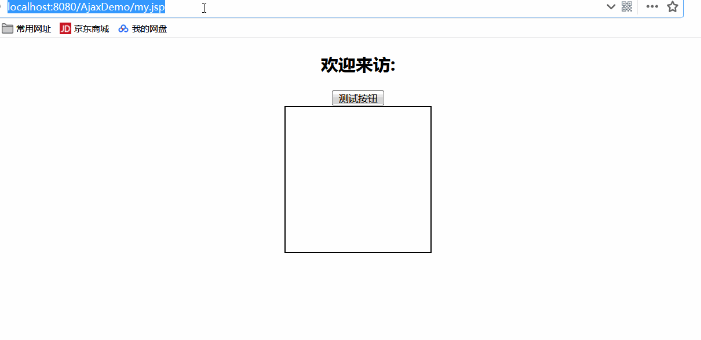

可见,设置为true(异步)时,先执行alert()脚本框内容,后再响应处理的结果

②设置为false值:

			//发送请求:	
		  	//get请求方式
			ajax.open("get","ajax?name=佩奇啊&pwd=hhhh",false); 
		//请求地址栏直接拼接  这里把false写错了,刚开始真没发现,最后Firefox调试发现了(不过一般显示就很明显,注意)
			ajax.send(null);
			alert("根据asyn的设置值,注意我弹出顺序"); ----------------- -- (注意)

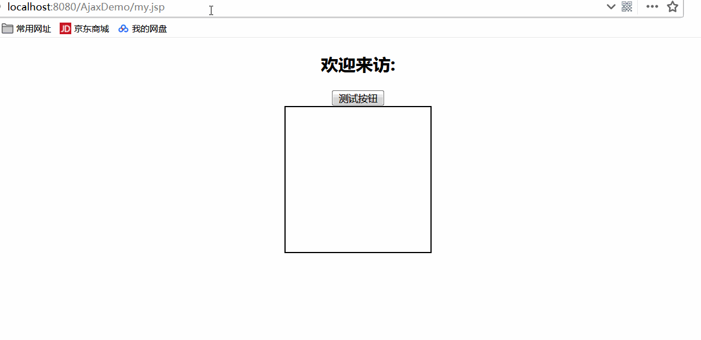

很明显,设置为false(同步)时,按照执行顺序来,等待响应处理后,执行脚本内容

注意:

不推荐使用 async=false，但是对于一些小型的请求，也是可以的。

请记住，JavaScript 会等到服务器响应就绪才继续执行。如果服务器繁忙或缓慢，应用程序会挂起或停止。

注意：当您使用 async=false 时，请不要编写 onreadystatechange函数,把代码放到send()语句后面即可：

		//发送请求:	
		  	//get请求方式
			ajax.open("get","ajax?name=佩奇啊&pwd=hhhh",false); 
		//请求地址栏直接拼接  这里把false写错了,刚开始真没发现,最后Firefox调试发现了(不过一般显示就很明显,注意)
			ajax.send(null);
			//alert("根据asyn的设置值,注意我弹出顺序"); 
		    document.getElementById("mydiv").innerHTML=ajax.responseText;

###小案例实现:如下图(输入学生姓名,返回其信息结果)

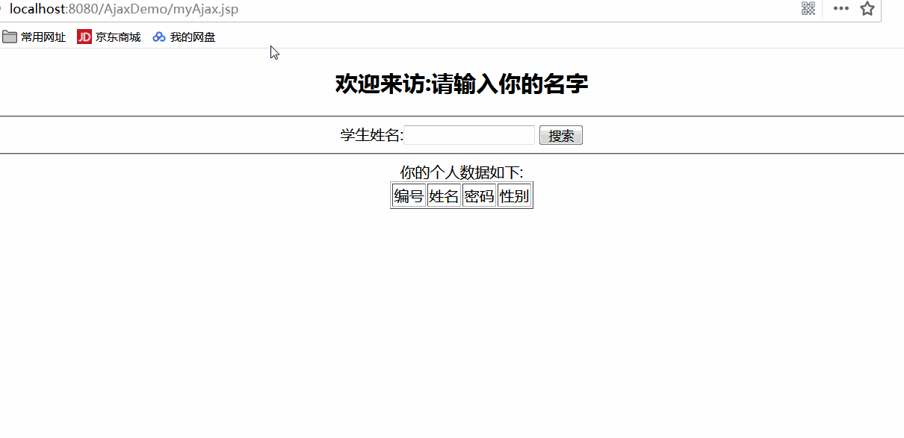

当然,前提是学生姓名存在,没有的自然没有信息

	需求分许：
	
		1、在当前页面内显示查询结果，考虑使用ajax
		2、创建ajax函数
		3、调用ajax函数发送请求到UserServlet
		4、调用业务层获取对应的数据

步骤一:

建立表格:

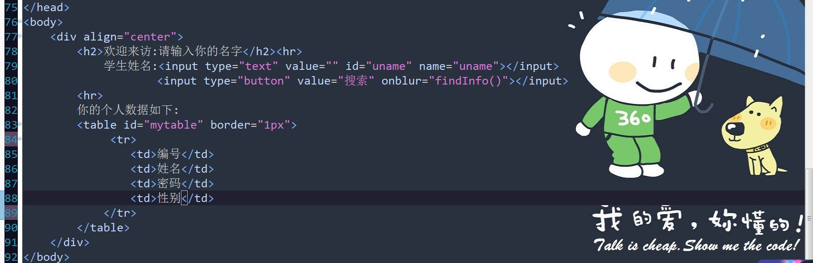

步骤二:

获取用户请求名字并处理

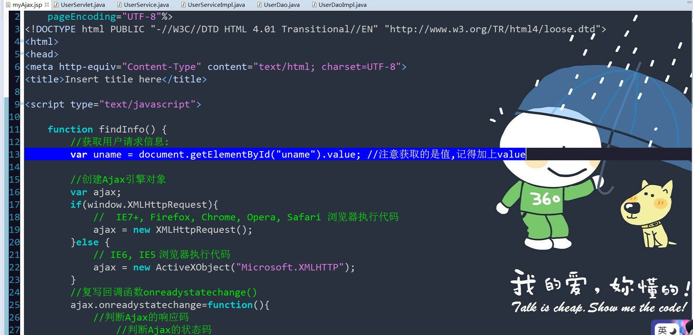

uname值,get的请求实体拼接在URL后面，？ 隔开，键值对.

	//发送请求:
			ajax.open("get", "user?name="+uname);
			ajax.send(null);

发起请求,UserServlet开始处理了:

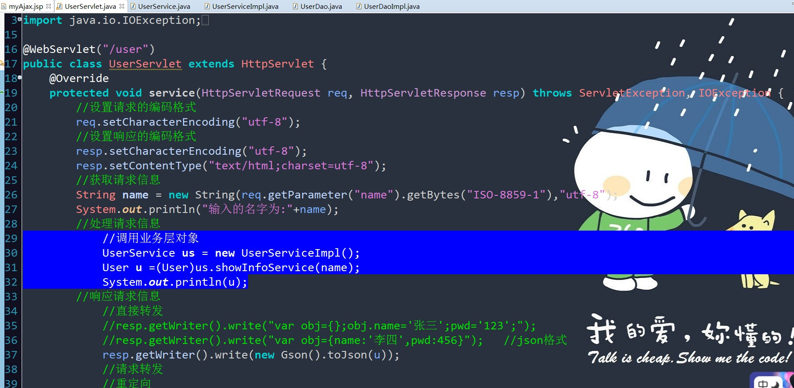

一系列操作,操作数据库,再返回 User u

##问题来了???

怎么把查找到的数据返回给浏览器呈现??(数据已封装至User u)

		//响应请求信息
			//直接转发
			//resp.getWriter().write("var obj={};obj.name='张三';pwd='123';");
			//resp.getWriter().write("var obj={name:'李四',pwd:456}");   //json格式

		//复写回调函数onreadystatechange()
		ajax.onreadystatechange=function(){
			//判断Ajax的响应码
				//判断Ajax的状态码
			if(ajax.readyState==4 && ajax.status==200){
				//获取响应数据
				var result = ajax.responseText;
				alert(obj.name);

这里,了解一下json(数据交换格式)

//json(重点)：responseText
			其实就是讲述数据按照json的格式拼接好的字符串，方便使用eval方法

			将接受的字符串数据直接转换为js的对象
									
			json格式：
				var 对象名={

						属性名:属性值,

						属性名:属性值,
						……
						}
									
			//XML数据：responseXML.返回document对象通过document对象将数据从xml中获取出来
				
			//处理响应内容(js操作文档结构)

简单来说,JSON 可以将 JavaScript 对象中表示的一组数据转换为字符串.

开始尝试(js认识的):

	resp.getWriter().write("var obj={name:'李四',pwd:456}");   //json格式

	//复写回调函数onreadystatechange()
		ajax.onreadystatechange=function(){
			//判断Ajax的响应码
				//判断Ajax的状态码
			if(ajax.readyState==4 && ajax.status==200){
				//获取响应数据
				var result = ajax.responseText;
				eval(result);
				alert(obj.name);
				alert(obj.pwd);

效果演示:

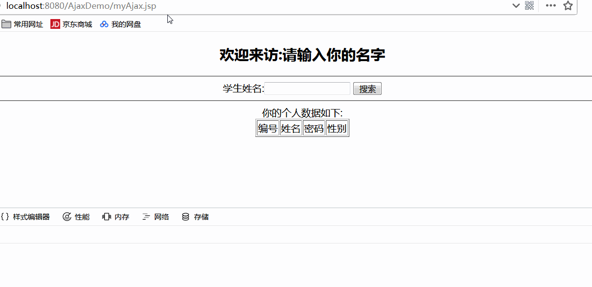

看这里:

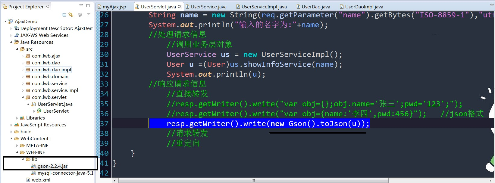

怎么取??

js中的eval函数:Eval把json格式字符串转换为json对象

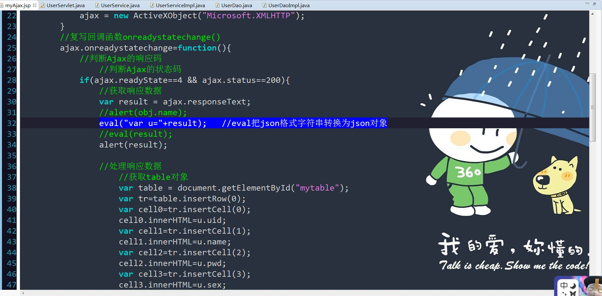

好了,Ajax基础知识到此结束啦啦啦